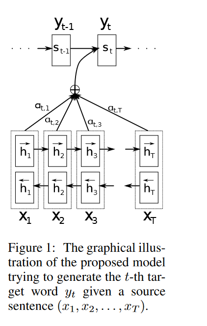

## 1 循环神经网络和神经机器翻译
- 基于循环神经网络和编码器—解码器结构的神经机器翻译模型在很长一段时间内都是神经机器翻译的主流模型。
- Bahdanau等人在编码器—解码器框架的基础上，提出了RNNSearch模型，该模型引入了注意力机制，使得生成每个目标端词语时，解码器可以将“注意力”集中到源端的几个相关的词语上，并从中获取有用的信息，从而获得更好的翻译表现。注意力机制使得翻译模型能够更好地处理长距离的依赖关系，解决了在循环神经网络中信息在长距离的传输中容易被丢失、遗忘的问题。RNNSearch模型被研究者广泛地用作基线模型。

## 2 RNNSearch解析

- 编码器：使用双向门控循环单元（GRU）对源语句进行编码，以使每个位置的编码同时包含前、后文本的历史信息。
- 双向GRU由前向GRU和后向GRU组成，前向GRU从左向右读取源语句并计算一系列前向隐状态（$h_１，...，h_ｎ$），反向ＧＲＵ从右向左扫描源语句，计算一系列后向隐状态（$h_１，...，h_ｎ$）。假设输入序列的词嵌入为（$x_１，...，x_ｎ$），则编码器如下所示。
$$h_i\rightarrow＝GRU（x_i，h_{i-1}），h_i\leftarrow＝GRU（x_i，h_{i+1}），
h_i＝［h_i \rightarrow，h_i\leftarrow］。$$

- 解码器：解码器是一个前向GRU，逐词预测译文ｙ。生成译文第$j$个词$y_j$的概率为: 
$$P(y_j | y<j,x,\theta) = softmax(t_{j-1},c_j,s_j)$$

其中，$t_{j-1}$是词$y_{j-1}$的词嵌入，$s_j$是解码器在第$j$步时的隐状态，$c_j$为第$j$步的注意力向量。
状态$s_j$计算公式：$s_j=GRU(t_{j-1},s_{j-1}，c_j）$。
注意力机制被用于提取与当前步预测高度相关的源端信息，防止源端信息在长距离的解码中被遗忘一部分。在第$j$步的解码中，与位置$i$的源端信息的相关度如下：
$$e_{ij}=v^T_atanh(W_as_{j-1}+U_ah_i)$$
注意力向量为源端信息按相关度的加权和如 式下：
$$a_{ij}=  {exp(e_{ij}) \over \sum_{i=1}^n{exp(e_{ij})}} ，c_j = \sum_{i=1}^T{a_{ij}h_i}$$