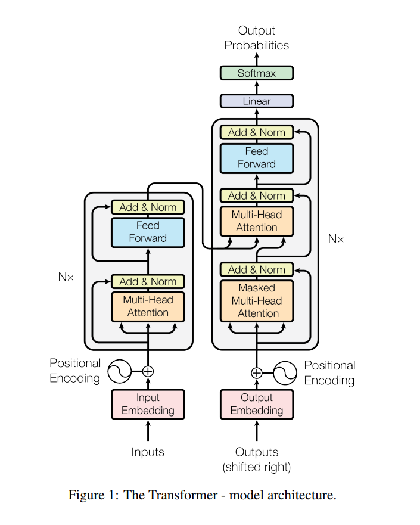

## 1 Transformer和机器翻译
- 2017年，Vaswani等人提出了完全基于注意力机制的Transformer模型，该模型创新性地使用了自注意力机制来对序列进行编码，其编码器和解码器均由注意力模块和前向神经网络构成。
- Transformer模型具有高度并行化的模型结构，因此在训练速度上远超循环神经网络，且在翻译质量上也有大幅提升。 
- Transformer已成为神经机器翻译研究中的主流模型。

## 参考
- Vaswani, A., Shazeer, N., Parmar, N., Uszkoreit, J., Jones, L., Gomez, A. N., ... & Polosukhin, I. (2017). Attention is all you need. Advances in neural information processing systems, 30.