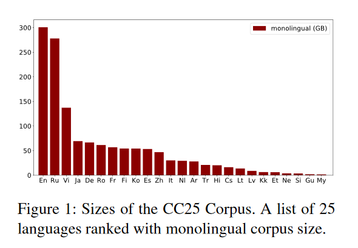

## Multilingual Denoising Pre-training for Neural Machine Translation
### 1. 贡献点
- 本文提出的mBART是第一个通过在多语言全文本进行降噪来预训练一个完整的seq2seq模型的方法，先前的方法都仅关注于编码器/解码器/重构文本的部分。
- 本文试图构建一个在大规模单语语料库上进行预训练的多语言降噪自编码器模型（以BART为基础的模型在多语言大规模单语语料库上进行预训练），用以解决有监督（句子级和文档级）和无监督机器翻译任务,并对影响预训练模型在MT上表现的多种因素进行探索。

### 2. 其他相关研究
- XLM, XLM-R, MASS等模型都是与mBART相关的多语言预训练模型。
- XLM和XLM-R只关注encoder部分，是基于BERT进行预训练的；MASS是seq2seq架构，但预训练的策略不同。

### 3. 实验内容
#### 3.1 数据
CC25 Corpus（Common Crawl corpus，包含25种语言）

- 对语料库进行采样均衡
- 用一个sentencepiece模型（SPM；Kudo和Richardson，2018）对包括25万个子词标记的完整CC数据进行tokenize。虽然并非所有这些语言都用于预训练，但这种token化支持在其他语言上进行微调。
#### 3.2 模型
- 遵循BART（Lewis等人，2019） Seq2Seq预训练计划（BART预先接受过英语训练）
- 本实验系统地研究了预先训练对不同语言组的影响
- 架构：使用标准的Seq2Seq Transformer架构(Vaswani等人，2017)，在16个头(680M参数)上有12层编码器和12层解码器，模型维度为1024。在编码器和解码器上都加入了一个额外的层归一化，发现在FP16的精度下可以稳定训练。
- 学习方法：定义了噪声函数g(X),通过输入g(X)来预测原文X。
    - 噪声方法：（1）句子换位；（2）35%掩码
    - 噪声函数: 按照Lewis等人(2019)的说法，在g中使用了两种类型的噪声，首先删除文本的跨度，并用mask token代替。我们根据泊松分布（λ=3.5）随机抽取跨度长度，对每个实例中35%的词进行mask。我们还对每个实例中的句子顺序进行了排序。解码器的输入是有一个位置偏移的原文。一个语言id符号\<LID>作为初始token来预测句子。
- 优化方法：详细参数见原文。

- 为了更好地衡量预训练期间不同的多语言程度的效果，本实验建立了以下一系列模型：
    - mBART25 使用在2.2节中描述的设置，在全部25种语言上预训练了模型。
    - mBART06 为了探索预训练对相关语言的影响，本实验对六种欧洲语言的子集进行了预训练：Ro, It, Cs, Fr, Es, and En。为了比较的公平性，使用了mBART批量大小的四分之一，这使得该模型在预训练种每种语言都有相同数量的更新。
    - mBART02 预训练双语模型，使用英语和其他一种语言的语言对：En-De, En-Ro, En-It。批量大小大约为mBART25的1/12。
    - BART-En/Ro 为了建立对多语预训练的理解，本实验还分别在En和Ro语料库上训练了单语BART模型。
    - Random 作为额外的基线，本实验还包括一个比较模型。该模型在未经预训练的情况下随机初始化，用于每个翻译任务。

- 扩展训练数据和模型参数一直是预训练的关键因素（Devlin等，2019；Conneau等，2019；Raffel等，2019）。与传统的半监督方法（如backtranslation）和其他MT的预训练相比（Lample和Conneau，2019；Song等人，2019），本实验在更多的单语数据上预训练mBART，架构相对更深。

### 4. 句子级机器翻译
#### 4.1 实验设置
- 收集了24对公开的平行语料，涵盖了CC25的所有语言。将数据集分为三类low-resource（<1M句对）、medium resource（>1M和<10M）和high-resource（>10M）。
- 微调与解码：我们对单对双文本数据进行微调，将源语言输入编码器，对目标语言进行解码。下图为我们的多语言降噪预训练（左）和下游MT任务微调（右）的框架，其中我们使用（1）句子换位和（2）词跨度mask作为注入的噪声。在编码器和解码器上都添加了一个特殊的语言id token。所有任务都使用一个多语言预训练模型。
%20and%20fine-tuning.jpg)

#### 4.2 结论

- mBART预训练在中low-resource的句子级MT环境中提供了一致的性能提升，包括仅有双文本和backtranslation，现有的预训练，并优于其他方案（§3.2）。
- 我们还提出了一个详细的分析。当目标语言单语数据有限时，对更多语言的预训练帮助最大。当单语言数据丰富时（De，Ro），多语言的预训练会稍微伤害最终结果（<1 BLEU）。

- 在没有任何预训练的情况下，我们的模型过拟合，表现比基线差很多。仅仅经过25K步（5%的训练），两个模型的表现都超过了最佳基线。在剩下的预训练中，模型不断改进超过3个BLEU，在500K步后还没有完全收敛。此外，mBART25始终略差于mBART02。

- 我们的预训练对high-resource对的翻译没有帮助。

- 即使对于预训练语料中没有出现的语言，mBART也可以提高性能，这表明预训练具有语言通用性。（§3.4）。

### 5. 文档级机器翻译
#### 5.1 实验设置
- 在两个常见的文档级MT数据集上评估性能。WMT19 En-De和TED15 Zh-En。
- 用预训练中使用的方法进行预处理。对于每个区块，句子用句末符号（</S>）分开，整个实例用特定的语言id（\<LID>）结束。平均来说，文档被分割成2-4个实例。
- 微调与解码: 我们使用与句子级翻译（§3.1）相同的微调方案。
- 基线与评估：我们训练了4个模型：一个文档级(Doc-)MT模型(§4.1)和一个对应的句子级(Sent-)MT模型(§3.1)作为基线，有预训练（mBART25）和无预训练。

#### 5.2 实验结果
%20The%20randomly%20initialized%20DocMT%20model%20cannot%20produce%20translations%20aligned%20to%20the%20original%20sentences%2C%20so%20only%20document%20evaluation%20is%20possible.jpg)
- 使用预训练权重初始化的MT模型，在句子级和文档级训练中，都以较大的幅度优于随机初始化模型。我们的mBART25模型（包括Sent-MT和DocMT）也优于HAN（Miculicich等人，2018），尽管它们没有为文档级MT定制。
- 预训练对文档级性能至关重要。一般来说，很难大量收集高质量的文档级数据，这说明预训练可能是未来工作的一个有力策略。
- 结果: 表7显示了与非预训练模型以及与现有预训练方法的模型比较的无监督翻译结果。我们的模型在所有方向上都比非预训练模型取得了很大的收益，超过现有方法完全失败的异构对（En-Ne，En-Si）上明显优于XLM。对于En-De，我们的模型与XLM和MASS的表现也相当出色。

### 6. 无监督机器翻译
总结了三种类型的无监督机器翻译：
- 无任何平行对齐的两种单语文本。（通过backtranslation进行无监督的机器翻译）
    - 数据集 ：在En-De、En-Ne和En-Si上评估我们的预训练模型。En和De都是欧洲语言，共享许多子词，而Ne和Si则与En相当不同。
    - 学习: 按照Lample和Conneau（XLM，2019），我们用mBART权重初始化翻译模型，然后学习预测单语句子，条件是由on-the-fly BT生成的源句。
    
    - 结果: 我们的模型在所有方向上都比非预训练模型取得了很大的收益，超过现有方法完全失败的异构对（En-Ne，En-Si）上明显优于XLM。对于En-De，我们的模型与XLM和MASS的表现也相当出色。
- 目标对没有双文本，但这两种语言都出现在与其他对的双文本语料中。
- 没有目标语对的双向文本，但有从其他语言翻译成目标语言的双向文本。
    - 数据集：我们只考虑X→En翻译，从§3.1中选择了12种语言对的位数，涵盖了印度语（Ne、Hi、Si、Gu）、欧洲语言（Ro、It、Cs、Nl）、东亚语言（Zh、Ja、Ko）和阿拉伯语（Ar）。
    
    
    - 结果： 预训练的mBART25模型在每个语言对上进行微调，然后在其余语言对上进行评估。我们看到，除了来自Gu-En的监督模型完全失败（0.3 BLEU）之外，所有微调模型的所有对都有迁移。在某些情况下，我们可以达到与监督结果相似（Cs-En）甚至更好的结果（Ne-En，Gu-En）。我们还在图7中展示了一个语言迁移的例子。

## Universal Conditional Masked Language Pre-trainingfor Neural Machine Translation 