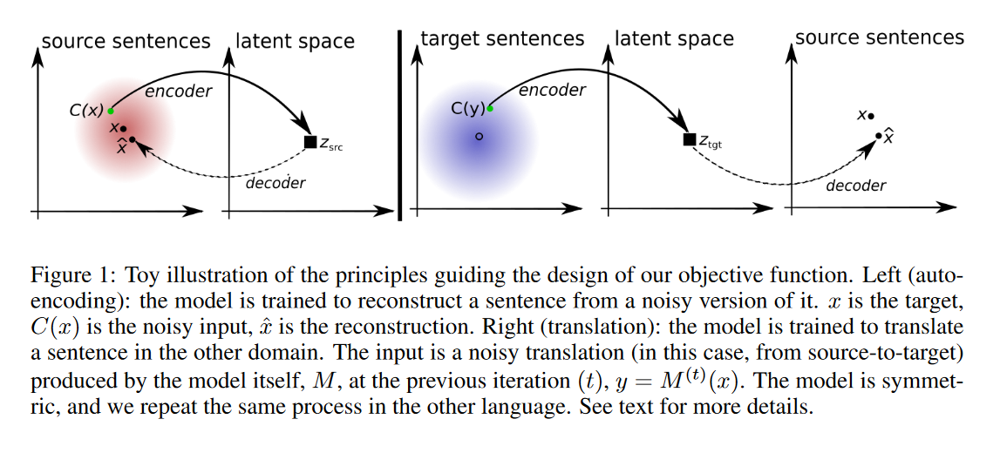
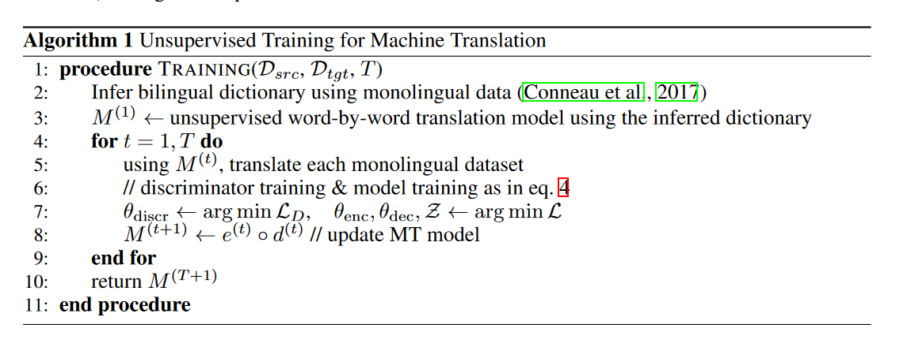
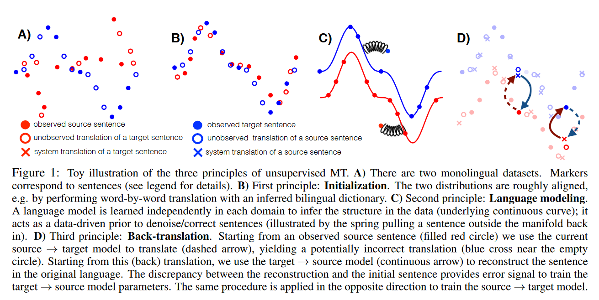

## 1 什么是无监督机器翻译？
无监督机器翻译(Unsupervised machine translation,UMT)是机器翻译的一种，在没有给定大规模双语平行语料的情况下，通过机器学习算法自动实现从一种自然语言到另一种自然语言的翻译。由于无监督机器翻译的方法避免了翻译模型对大规模平行语料的过度依赖，更适合低资源语言或领域

## 2 无监督机器翻译的发展
无监督神经机器翻译从 2017 年（Facebook提出）首次被实现至今，已经取得了很大的进步。其发展历程大约经历3个阶段：
- 第一个阶段为2017年Artetxe等人和Conneau等人分别使用无监督的方法实现跨语言词嵌入，再根据所学习到的映射矩阵获取词表，随后通过语言模型训练和反向翻译两项技术实现了无监督神经机器翻译。
- 第二阶段为Lample归纳的无监督神经机器翻译的三大原则，同时共享双语词汇表联合学习双语词嵌入，并通过BPE 编码将词表从单词转换为子词。
- 第三个阶段为无监督跨语言预训练模型的提出，成功将预训练模型应用到了无监督神经机器翻译任务上，大幅度刷新了无监督神经机器翻译的性能。
- 研究者们在这三个阶段的发展基础上提出了自己对无监督神经机器翻译模型的改进，如Yang等人在2019年提出的将共享编码器改为独立编码器以强化句子本身的语言特征；Ji等人在2020年使用词典完成的不同语系的无监督神经机器翻译。

## 3 通过同时训练去噪自动编码和回译任务的方法
### WORD TRANSLATION WITHOUT PARALLEL DATA (Alexis Conneau, ICLR， 2018)

基于字典的方法，基于“上下文相似的词，语义相似”的基础假设。可以推测其单语语料库本质上应该还是对齐的。
- 首先将源语言和目标语言训练成词向量映射到一个巨大的向量空间中；
- 加入对抗训练（GAN），初始化源语言和目标语言的向量对齐（粗对齐），映射函数（旋转矩阵）为W(线性变换)
- 选取高质量的近邻词作为锚点，对W进行微调（对齐FineTune），即可将结果拓展到整个完整的词空间，提升源语言和目标语言字典的对齐质量。
- 作者还希望每个词和译文为最近邻，但会出现高维空间密集现象，即一个点可能是很多个点的最近邻，为此，设计了Cross-domain Similarity Local Scaling（CSLS）以取代余弦来计算最近邻。

### UNSUPERVISED MACHINE TRANSLATION USING MONOLINGUAL CORPORA ONLY (Guillaume Lample, ICLR， 2018)

基于模型构建的方法
- 与上文相比，真正从“词向量”对齐迈入“隐层状态对齐”
- 利用一个encoder-decoder思维。encoder可以把一种语言编码转换成一种通用表示，decoder则可以把通用表示还原成任意一种语言。
- 如果一个自动编码器被调教成完全按照输入的方式重建输入，那么它可能什么都做不了。所以在训练过程中不断加入噪音，来训练其（1）从加噪音的源句中还原源句的能力；（2）从加噪音的译文中还原源句的能力。
- decoder如何判断生成的语种：区分其解码起始符\<s>

### Phrase-Based & Neural Unsupervised Machine Translation（Guillaume Lample, EMNLP, 2018）

基于机器翻译模型，总结了前两篇论文的方法：
- Datasets（A）：蓝色和红色分别代表两种语言。从图上可以直观地看到，蓝线和红线的基本形状相似。这是无监督的最大前提，两种语言的语料必须是同领域同来源的。如果是不相干的文本内容，基本上是无法做到对齐的。
- Initialization（B）：蓝线和红线基本重合，即词级别粗对齐，获得初始翻译模型 $M_0$ 。先对两种语言分别处理得到词向量（fastText），再进行无监督词对齐（MUSE）。
- Language Modeling（C）：提供两种语言各自的 data-driven 先验知识，帮助局部替换和调序（用弹簧把线条外的词，拉回来）。这部分对应着 NMT 中引入去噪自编码的原文重建过程。
- Back Translation（D）：将实心红点的原文，翻译为蓝色叉字的译文（虚线过程），再回译为红色原文（实现过程），即译文重建过程。需要注意，backprop 只更新实现的回译模型，不更新虚线的翻译模型。这样设计一来是简单，二来作者说加上也没效果。
- Share Latent Representations：图上没有。encoder 和 decoder 共享隐层参数，在解码的第一次添加语种标记。同时，使用 GAN 拉近编码空间。

- 初始化双语词表词向量。
    - 使用Word2vec单独训练两种语言的词向量，再通过学习一个变换矩阵将两种语言的词向量映射到同一个潜在空间。这样就可以获得一个精确度良好的双语词表。
    - 使用单词的字节对编码(BPE:Byte Pair Encoding)作为子字单元。这样做的好处是在减少了词表大小的同时，清除了翻译过程中出现“未知(UNK)”的问题。
    - 相比于第一种方法，第二种方法选择将两种单语语料混合打乱后共同学习词向量特征，源语言和目标语言可共享同一个词表。但是这样的跨语言词嵌入有个前提，即两种语言是同一语系中的相似语言。
- 语言建模
- 迭代翻译

### Adapting High-resource NMT Models to Translate Low-resource Related Languages without Parallel Data (Wei-Jen Ko, ACL, 2021)
- 出发点：虽然更好地翻译低资源相关语言的直观方法可能是获得高质量的并行数据，但缺乏专业知识或双语翻译，这种方法通常不可行，同时，低资源语言的质量控制中出现的问题加剧了这些问题（(Guzman et al., 2019）。这种稀缺性促使我们学习低资源语言的机器翻译模型，同时利用现成的数据，例如来自密切相关语言的并行数据或低资源语言中的单语数据。
- 方法：在不使用任何低资源语言并行数据的情况下将低资源语言翻译成英语和从英语翻译成英语的 NMT-Adapt 方法。
    - 利用一种新颖的多任务领域适应方法 NMT-Adapt 将英语翻译成低资源语言。
    - 执行源域适应以将低资源语言翻译成英语。
    - 利用这两个域适应来执行迭代回译——进一步提高双向翻译质量。

    %20and%20from%20an%20LRL%20to%20English.jpg)
首先通过微调 mBART 在高资源到英语的并行数据上创建英语到低资源的回译数据。使用此模型，将单语低资源文本翻译成英语，将低资源句子视为​​高资源语言。生成的句子对用作回译数据，以训练我们的英语到低资源模型的第一次迭代。在将英语训练成低资源语言后，我们使用模型将 English-HRL 并行数据中的英语句子翻译成低资源语言，并使用这些句子对作为回译数据来训练我们的低资源语言的第一次迭代英语模型。然后，我们使用第一个低资源到英语模型为第二个英语到低资源模型生成反向翻译对。我们迭代地重复这个过程，使用我们的一个方向的模型来改进另一个方向。

### A Retrieve-and-Rewrite Initialization Method for Unsupervised Machine Translation 
####出发点
无监督机器翻译常用的框架是建立两个翻译方向的初始翻译模型，然后进行迭代回译以共同提升其翻译性能。初始化阶段非常重要，因为糟糕的初始化可能会错误地挤压搜索空间，并且在此阶段引入过多噪声可能会影响最终性能。在本文中，提出了一种新的基于检索和重写的方法来更好地初始化无监督翻译模型。
#### 有用的知识
- 以往的无监督翻译模型初始化都是基于短语的统计机器翻译（PBSMT）
#### 方法

- 借助无监督的跨语言句子嵌入，从两种语言的单语语料库中检索语义相似的句子对。
    - 使用 fastText (Bojanowski et al., 2017) 和 vecmap (Artetxe et al., 2018a) 构建 X 和 Y 的无监督跨语言词嵌入，
    - 通过 SIF 获得基于跨语言词嵌入的跨语言句子嵌入 (Arora et al., 2017)。
    - 使用基于边缘的评分（Artetxe 和 Schwenk，2018）来检索相似的句子对。
- 运行 GIZA++（Och 和 Ney，2003）以获得单词对齐，用于删除检索到的句子的目标侧未对齐的单词。使用设计的序列到序列重写模型重写修改后的目标句子，以最小化源端和目标端之间的语义差距。
- 将源语句和相应的重写目标对作为伪并行数据，然后构建两个初始 PBSMT 模型（源到目标和目标到源），用于生成伪并行数据以预热 NMT 模型，然后通过迭代回译训练过程。

## 4 预训练-无监督机器翻译
Cross-lingual Language Model Pretraining
Unsupervised Neural Machine Translation with SMT as Posterior Regularization

## 5 无监督机器翻译面临的挑战
- 目前无监督机器翻译的研究工作多基于英、法、德等同源语言。由于在非同源语言之间， 例如中英、英日等，学习到的词向量质量较低，无监督神经机器翻译在这些语言对上获得的性能较差。
- 目前无监督机器翻译的研究工作多假设测试集的领域与训练集领域类似，存在一定的局限性。除了测试集与训练集的领域可能不一致外，无监督翻译使用的源端和目标端单语语料还可能存在着领域不一致和数量规模不一致等问题，使得无监督神经机器翻译领域自适应问题变得更具挑战性。

然后我又想，现在用mbart在没微调的情况下虽然无法直接翻译成目标语，但在两种大规模的单语情况下通过不断地加噪回译后有没有可能可以提升模型对两种单语的适应，进而达到接近微调的效果？因为mbart这种语言模型本身有知识的。

此外，为了缩小不同语言之间的表示差距并充分利用多语言知识，我们明确引入了基于源句和目标句中单词的随机和对齐替换的额外损失。替换句子以与原始多语言平行语料库相同的翻译损失联合训练。通过这种方式，该模型能够更紧密地跨越不同语言的表示空间。