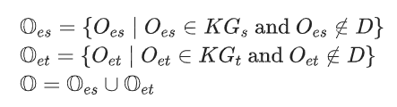
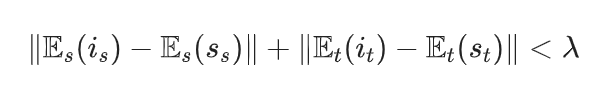
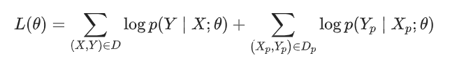

## 知识图谱增强的机器翻译
在机器翻译中，实体的正确翻译对于译文质量有着至关重要的作用。知识图（KG）在各种实体上存储了大量结构化信息，其中许多实体不在神经机器翻译（NMT）的双语句子对中，导致实体的错翻率较高，知识图谱的嵌入可以提升神经机器翻译中的实体翻译。

本文的亮点主要包括：

(1)提出了一种将非并行KG合并到NMT模型中的方法。
(2)设计了一种新的方法来归纳K-D实体使用KG生成的翻译结果，生成伪并行句子对，并促进NMT更好地预测K−D实体。

## **模型**

**问题定义：**

本文所利用的数据资源包括以下三个：

1.双语句子对：D={(X,Y)}，其中X是源语言，Y是目标语言。

2.源语言知识图谱：$KG_s={(h_s, r_s, t_s)}$ ，其中$h_s$为源端头实体，$t_s$为源端尾实体，$r_s$为它们之间的关系。

3.目标语言知识图谱：$KG_t={(h_t, r_t, t_t)}$，其中$h_t$为目标端头实体，$h_t$为目标端尾实体，$t_t$为它们之间的关系。

注：$KG_s$和$KG_t$并不是互相平行的。本文的目的是提升K-D实体的翻译质量，其中K-D实体的定义为：

其中$O_es$和$O_e$分别为源端K-D和目标端K-D。

**框架：**

模型整体框架如下：

**本文所提方法包括三个步骤：**

**1.双语K-D实体推断**

①将源语言知识图谱$K_s$和目标语言知识图谱$K_t$利用知识表示学习（例如TransE和TransH等），将源端实体和目标端实体分别表示为向量$E_s$和$E_t$。

②利用双语句对，首先提取出短语翻译对，利用上述段语言翻译对作为种子实体翻译对。

③利用种子实体翻译对为锚点，将$E_s$和$E_t$映射到同一语义空间。

④根据语义距离，预测出K-D实体的译文。

**2．伪双语数据构造**

推断实体对和种子实体对之间的语义距离： 

如果它们之间的距离小于预定义的阈值λ，就将种子词的上下文迁移至推断实体对的上下文，进而生成伪双语数据。

3．联合训**练**

将原始双语数据和伪双语数据进行联合训练，学习神经机器翻译的参数，损失函数为：&#x20;

**实验**

**1.总体结果**

本文所提方法在中英（医疗领域、旅游领域和通用领域）和英日翻译任务上均有一定BLEU值的提升。

**2.超参数分析**

在算法1中，本文设置了一个预定义的超参数δ来确定双语对。表中显示了不同δ（医学KG）的BLEU分数。可以看到，当δ=0.45时，BLEU分数最大。当δ超过0.45时，BLEU分数（dev）从15.96降至14.94。同时结果表明：需要在K −D实体对的数量之间取得平衡，并不是越多越好。

**3.K-D实体的分析**

给出了不包含（Sent w/o K-D）和包含K-D（Sent w K-D）实体句子的BLEU值，从表中可以看出，所提方法对于包含K-D（Sent w K-D）实体句子有着明显的提升。

## **总结**

为了解决NMT中的K-D实体，本文提出了一种知识图谱增强的NMT方法。本文设计了一种新的方法来归纳K-D实体使用KG生成的翻译结果，生成伪并行句子对，最后联合训练NMT模型。在汉英翻译和英日翻译任务上的大量实验表明，本文方法在翻译质量上明显优于基线模型，尤其是在处理K−D实体上。

Zhao, Y., Zhang, J., Zhou, Y., & Zong, C. (2021, January). Knowledge graphs enhanced neural machine translation. In *Proceedings of the Twenty-Ninth International Conference on International Joint Conferences on Artificial Intelligence* (pp. 4039-4045).