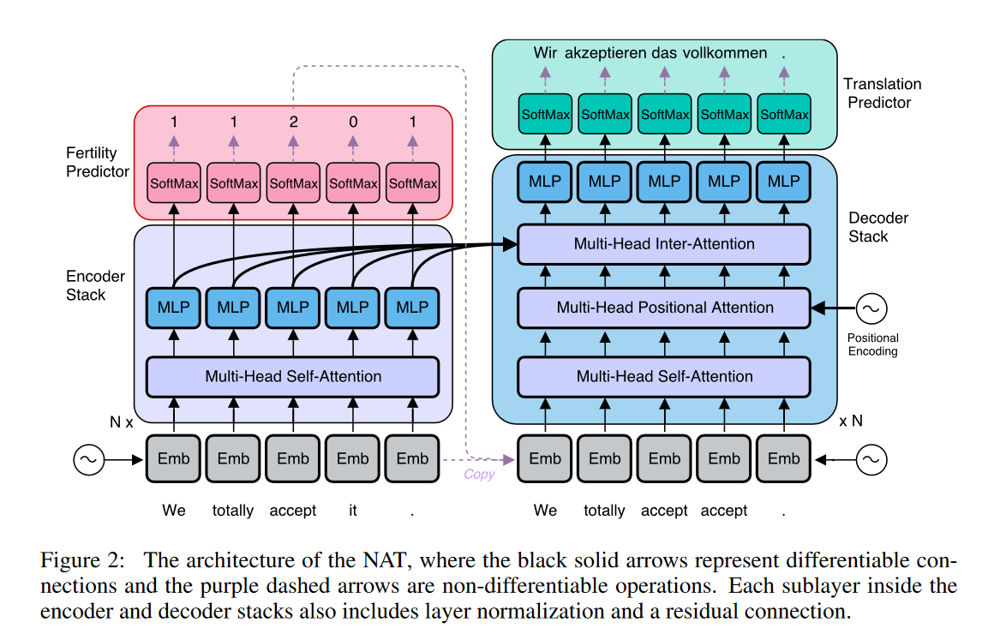

## 什么是非自回归机器翻译（NAT）？
- 目前主流的神经机器翻译模型为自回归模型， 每一步的译文单词的生成都依赖于之前的翻译结果 ，因此模型只能逐词生成译文，翻译速度较慢 。
- Gu等人提出的非自回归神经机器翻译模型(NAT)对目标词的生成进行独立的建模，因此能够并行解码出整句译文，显著提升了模型的翻译速度。

缺点：
- **翻译效果差**：非自回归模型在翻译质量上与自回归模型有较大差距，主要表现为模型在长句上的翻译效果较差，译文中通常包含较多的重复词和漏译错误。
- **多峰性**：Gu等人指出，在给定原文时，目标端参考译文的概率分布具有“多峰性”，即一句原文可能对应多句意思相近的译文。由于无法进行teacher forcing训练，译文的“多峰性”会对模型的训练造成很大干扰。

优化方法：
- **知识蒸馏**：要提升非自回归模型的翻译质量，最简单有效的方法是进行序列级的知识蒸馏。知识蒸馏能降低目标端文本的“复杂度”，从而降低模型的学习难度。
- **引入隐变量**：Gu等人首先提出引入隐变量来减小译文的不确定性，以此克服译文的“多峰性”问题。他们用产出率(Fertility)来表示原文单词对应到译文单词的数目，并将其作为隐变量。给定产出率时，译文空间会受到很大限制，从而缓解了译文的“多峰性”问题。随后，离散隐变量被引入到了非自回归模型中，并取得了显著的效果提升。引入隐变量也有一定缺陷，即对隐变量的建模会降低非自回归模型的翻译速度。
- **对训练目标的改进**：除隐变量外，对训练目标的改进也能有效地提升翻译质量，且一般不会影响翻译速度。Wang等人直接在训练目标中加入正则化项，以此来抑制模型的重复翻译和漏译错误。Sun等人用ＣＲＦ对翻译概率进行建模，并用对应的损失函数来优化模型。Libovicky等人将ＣＴＣ损失应用在非自回归模型中，使得模型可以产生空单词，摆脱对译文长度预测的依赖。Shao等人在模型中融入序列信息，改进强化学习算法来进行序列级训练，用对译文“多峰性”不敏感的序列级指标来训练模型。随后针对非自回归模型提出了Bag-of-Ngrams训练目标，该训练目标具有可导、计算方便、与翻译质量相关性高等优点，能够稳定、高效地训练非自回归模型，相对强化学习方法，翻译效果有大幅提升。
- **迭代式的解码**: 对非自回归模型的另一个改进思路为迭代式的解码，即通过多轮迭代，在牺牲一定翻译速度的前提下提升翻译质量。Lee等人首次提出了迭代式的解码方法，并给出了自适应地控制迭代轮数的方法。Ghazvininejad等人提出了基于Mask Predict的迭代解码方法，在每一轮的解码结果中掩盖掉模型不确定的部分，并在下一轮对其进行预测。Gu等人提出Levenshtein Transformer模型，对译文进行多轮的删除和插入操作，直至译文不再改变。目前，迭代式的解码技术已能让非自回归模型达到接近自回归模型的翻译效果，并仍保持着数倍于自回归模型的解码速度。

参考
- Gu, J., Bradbury, J., Xiong, C., Li, V. O., & Socher, R. (2017). Non-autoregressive neural machine translation. arXiv preprint arXiv:1711.02281.