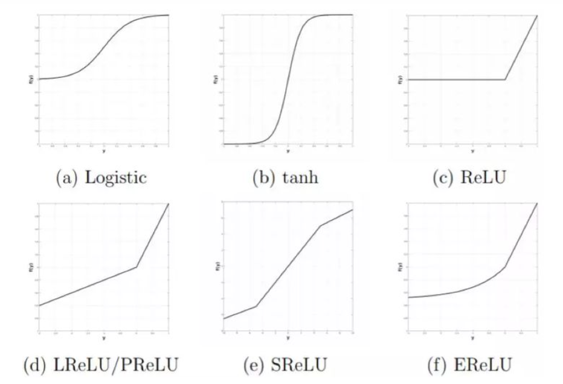

# CNN

## 1. 关于CNN

卷积网络（CNN）是一类尤其适合计算机视觉应用的神经网络，因为它们能使用局部操作对表征进行分层抽象。有两大关键的设计思想推动了卷积架构在计算机视觉领域的成功。第一，CNN 利用了图像的 2D 结构，并且相邻区域内的像素通常是高度相关的。因此，CNN 就无需使用所有像素单元之间的一对一连接（大多数神经网络都会这么做），而可以使用分组的局部连接。第二，CNN 架构依赖于特征共享，因此每个通道（即输出特征图）是在所有位置使用同一个过滤器进行卷积而生成的。标准卷积网络的结构的示意图如下：

## 2. CNN 的构建模块

### 2.1 卷积层

卷积层可以说是 CNN 架构中最重要的步骤之一。基本而言，卷积是一种线性的、平移不变性的运算，其由在输入信号上执行局部加权的组合构成。根据所选择的权重集合（即所选择的点扩散函数（point spread function））的不同，也将揭示出输入信号的不同性质。在频率域中，与点扩散函数关联的是调制函数——说明了输入的频率组分通过缩放和相移进行调制的方式。因此，选择合适的核（kernel）对获取输入信号中所包含的最显著和最重要的信息而言至关重要，这能让模型对该信号的内容做出更好的推断。

### 2.2 整流（激活函数）

多层网络通常是高度非线性的，而整流（rectification）则通常是将非线性引入模型的第一个处理阶段。整流是指将点方面的非线性（也被称为激活函数）应用到卷积层的输出上。这一术语借用自信号处理领域，其中整流是指将交流变成直流。这也是一个能从生物学和理论两方面都找到起因的处理步骤。计算神经科学家引入整流步骤的目的是寻找能最好地解释当前神经科学数据的合适模型。另一方面，机器学习研究者使用整流的目的是为了让模型能更快和更好地学习。有趣的是，这两个方面的研究者往往都认同这一点：他们不仅需要整流，而且还会殊途同归到同一种整流上。

### 2.3 归一化

正如前面提到的，由于这些网络中存在级联的非线性运算，所以多层架构是高度非线性的。除了前一节讨论的整流非线性，归一化（normalization）是 CNN 架构中有重要作用的又一种非线性处理模块。CNN 中最广泛使用的归一化形式是所谓的 Divisive Normalization（DN，也被称为局部响应归一化）。

### 2.4 池化

不管是生物学启发的，还是纯粹基于学习的或完全人工设计的，几乎所有 CNN 模型都包含池化步骤。池化运算的目标是为位置和尺寸的改变带来一定程度的不变性以及在特征图内部和跨特征图聚合响应。池化在生物学和理论研究上都具有支持。在 CNN 网络的这个处理层上，主要的争论点是池化函数的选择。使用最广泛的两种池化函数分别是平均池化和最大池化。
