# RNNs（Recurrent neural networks ）

## 1. 关于RNN&#x20;

人工神经网络（ANN）由多层互相连接的称为人工神经元的单元构成。「浅层网络」指的是没有循环连接，且只有一个输入层、一个输出层，并至多只有一个隐藏层的 ANN。随着网络层数增加，复杂度也增加。层数或循环连接数的增加通常会增加网络的深度，从而使网络能提供多层次的数据表征以及特征提取，即「深度学习」。

结合了循环连接的 ANN 被称为循环神经网络（RNN），可以对序列数据建模，用于序列识别和预测。RNN 隐藏状态的结构以循环形成记忆的形式工作，每一时刻的隐藏层的状态取决于它的过去状态。这种结构使得 RNN 可以保存、记住和处理长时期的过去复杂信号。RNN 可以在当前时间步将输入序列映射到输出序列，并预测下一时间步的输出。

循环神经网络（RNN）能够从序列和时序数据中学习特征和长期依赖关系。RNN 具备非线性单元的堆叠，其中单元之间至少有一个连接形成有向循环。训练好的 RNN 可以建模任何动态系统；但是，训练 RNN 主要受到学习长期依赖性问题的影响。

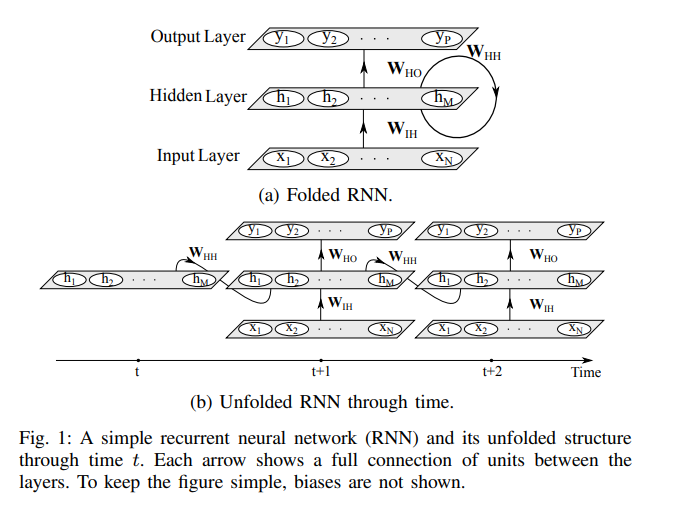

RNN 是一类监督式机器学习模型，由人工神经元和一或多个反馈循环构成。反馈循环指时间或序列（本文以下使用「时间」）的循环周期，如上所示。以监督式方法训练 RNN 需要一个输入-目标对的训练数据集。其目的在于通过优化网络权重最小化输出和目标对（即损失值）的差。

## 2. 相关研究

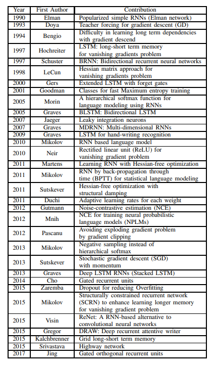

## 3. RNN模型基础

简单 RNN 有三层：输入层、循环隐藏层和输出层，如a 所示。输入层中有 N 个输入单元。该层的输入是一系列沿时间 t 的向量 {..., x\_t−1, x\_t, x\_t+1, ...}，其中 x\_t = (x\_1, x\_2, ..., x\_N)。全连接 RNN 中的输入单元与隐藏层中的隐藏单元连接，该连接由权重矩阵 W\_IH 定义。隐藏层有 M 个隐藏单元 h\_t = (h\_1, h\_2, ..., h\_M)，它们通过网络定义的循环结构沿时间彼此连接，如b。使用较小非零元素的隐藏单元初始化能够提升网络的整体性能和稳定性。隐藏层将状态空间或系统的「memory」定义为：

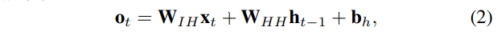

其中 f\_H(·) 是隐藏层激活函数，b\_h 是隐藏单元的偏置向量。隐藏单元与输出层连接，连接权重为 W\_HO。输出层有 P 个单元 y\_t = (y\_1, y\_2, ..., y\_P )，可以计算为：

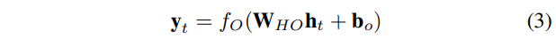

其中 f\_O(·) 是激活函数，b\_o 是输出层的偏置向量。由于输入-目标对是沿时间的序列，因此上述步骤随着时间 t = (1, ..., T ) 重复。公式 (1) 和 (3) 展示了 RNN 由特定非线性状态公式构成，该公式沿时间迭代。在每个时间步中，隐藏状态根据输入向量预测输出。RNN 的隐藏状态是一组值的集合（除去任何外部因素的影响），该集合总结了与该网络在之前很多时间步上的状态相关的必要信息。该整合信息可定义该网络的未来行为，作出准确的输出预测。RNN 在每个单元中使用一个简单的非线性激活函数。但是，如果此类简单结构沿时间步经过良好训练，则它能够建模丰富的动态关系。

## 4. 激活函数

下图展示了一些最流行的激活函数。

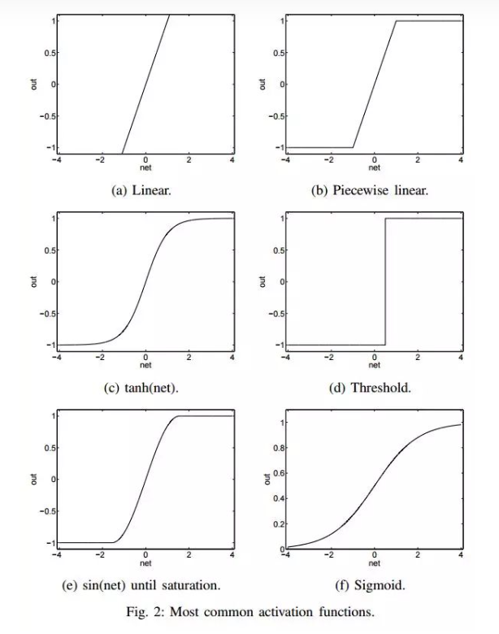

近期 Sigmoid、Tanh 和 ReLU 得到了更多关注。Sigmoid 函数是常见选择，它将真值归一化到 \[0, 1] 区间。该激活函数常用语输出层，其中交叉熵损失函数用于训练分类模型。Tanh 和 Sigmoid 激活函数分别被定义为：

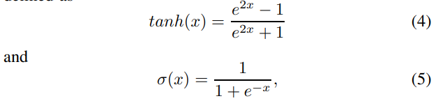

Tanh 激活函数实际上是缩放的 Sigmoid 函数，如：

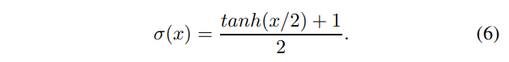

ReLU 是另一个常用激活函数，向正输入值开放 \[3]，定义为 y(x) = max(x, 0)。

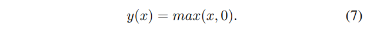

激活函数的选择主要取决于具体问题和数据的本质。例如，Sigmoid 函数适合输出区间为 \[0, 1] 的网络。而 Tanh 和 Sigmoid 函数会使神经元快速饱和，并导致梯度消失。Sigmoid 的输出不以零为中心会导致不稳定的权重梯度更新。与 Sigmoid 和 Tanh 函数相比，ReLU 激活函数导致更加稀疏的梯度，并大幅加快随机梯度下降（SGD）的收敛速度 。ReLU 函数的计算成本低廉，因其可通过将激活值二值化为零来实现。但是，ReLU 无法抵抗大型梯度流（gradient flow），随着权重矩阵增大，神经元可能在训练过程中保持未激活状态。

## 5. 训练循环神经网络

有效地训练 RNN 一直是重要的话题，该问题的难点在于网络中难以控制的权重初始化和最小化训练损失的优化算法。这两个问题很大程度上是由网络参数之间的关系和隐藏状态的时间动态而引起 。本论文文献综述所展现的关注点很大程度上都在于降低训练算法的复杂度，且加速损失函数的收敛。然而，这样的算法通常需要大量的迭代来训练模型。训练 RNN 的方法包括多表格随机搜索、时间加权的伪牛顿优化算法、梯度下降、扩展 kalman 滤波（EKF）、Hessian-free、期望最大化（EM）、逼近的 Levenberg-Marquardt 和全局优化算法。在这一章节中，本论文具体讨论了这样一些方法。

下表展示了 GD 算法各种变体的优势缺点，其中 N 为神经网络的结点数、O(.) 为每个数据点的复杂度：

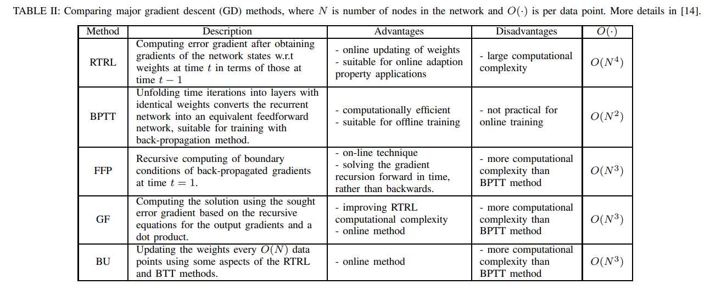

## 6. 循环神经网络架构

### 6.1 深度 RNN 结合多层感知机

神经网络的深层架构相比浅层架构可以指数量级高效地表征函数。虽然由于每个隐藏状态都是所有过去隐藏状态的函数，使得循环神经网络在时间上就是内在的深度网络，但是人们已证明其内在运算实际上是很浅层的。在 RNN 的转换阶段添加一个或多个非线性层可以更好地理解初始输入的潜在变化，从而提升网络的整体性能。结合了感知机层的 RNN 的深度结构可以分成三类：输入到隐藏、隐藏到隐藏，以及隐藏到输出 。

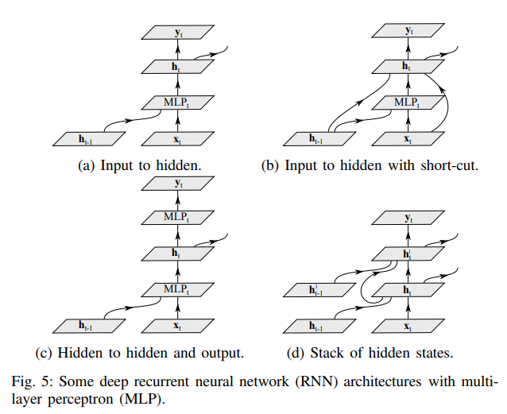

（1）深度输入到隐藏：其基本思想之一是将多层感知机（MLP）结构引入转换和输出阶段，分别称为深度转换 RNN 和深度输出 RNN。

（2）深度隐藏到隐藏和输出：深度 RNN 重点关注于隐藏层的构造。在隐藏层中，来自过去数据抽象和新输入的数据抽象与/或隐藏状态结构都是高度非线性的。

（3）隐藏状态的堆叠：另一种构造深度 RNN 的方法是如d 所示的方式堆叠隐藏层。这种类型的循环结构可以使网络在不同的时间尺度上工作，并允许网络处理多种时间尺度的输入序列。

### 6.2 双向 RNN（Bidirectional RNN）

传统的 RNN 在训练过程中只考虑数据的过去状态。虽然在很多应用中只考虑过去状态已经充分有效（例如语音识别），但是探索未来的状态也是很有用的。之前，人们尝试通过对输出延迟确定时间帧数，以在 RNN 的基础架构上利用未来状态作为当前预测的环境。然而，这种方法需要在所有的实现中手动优化延迟时间。而双向 RNN（BRNN）利用了过去和未来的所有可用输入序列评估输出向量 。其中，需要用一个 RNN 以正向时间方向处理从开始到结束的序列，以及用另一个 RNN 处理以反向时间方向处理从开始到结束的序列，如下图所示。

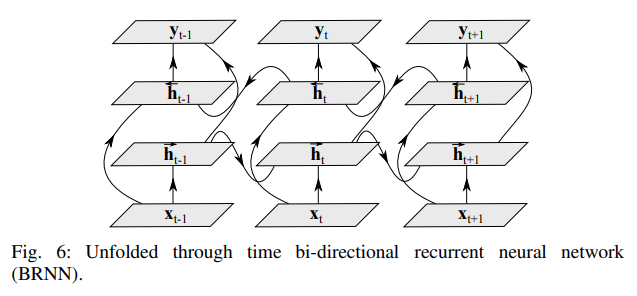

### 6.3 循环卷积神经网络

&#x20;      RNN 中仍然乏在多个维度对上下文依赖关系的理解。其中最流行的网络架构使用了卷积神经网络（CNN）解决这些问题。将循环连接整合到每个卷积层中，可以构成循环卷积神经网络（RCNN）。RCNN 单元的激活值依赖于近邻的单元而随时间变化。这种方法可以整合上下文信息，对于目标识别任务很重要。这种方法可以增加模型的深度，而参数数量通过层间的权重共享保持不变。使用从隐藏层中从输出到输入的环连接使网络可以建模标签依赖关系，并基于它的过去输出平滑输出。这种 RCNN 方法可以将大量入上下文馈送到网络中去，同时限制模型的容量。这个系统可以用较低的推理成本建模复杂的空间依赖关系。

### 6.4 多维循环神经网络

多维循环神经网络（MDRNN）是 RNN 的高维序列学习的另一种实现。这种网络在每个维度使用循环连接以学习数据内的关系。

### 6.5 长短期记忆（LSTM）

使用传统的通过时间的反向传播（BPTT）或实时循环学习（RTTL/Real Time Recurrent Learning），在时间中反向流动的误差信号往往会爆炸（explode）或消失（vanish）。但LSTM可以通过遗忘和保留记忆的机制减少这些问题。

LSTM 单元一般会输出两种状态到下一个单元，即单元状态和隐藏状态。记忆块负责记忆各个隐藏状态或前面时间步的事件，这种记忆方式一般是通过三种门控机制实现，即输入门、遗忘门和输出门。

以下是 LSTM 单元的详细结构，其中 Z 为输入部分，Z\_i、Z\_o 和 Z\_f 分别为控制三个门的值，即它们会通过激活函数 f 对输入信息进行筛选。一般激活函数可以选择为 Sigmoid 函数，因为它的输出值为 0 到 1，即表示这三个门被打开的程度。

若我们输入 Z，那么该输入向量通过激活函数得到的 g(Z) 和输入门 f(Z\_i ) 的乘积 g(Z) f(Z\_i ) 就表示输入数据经筛选后所保留的信息。Z\_f 控制的遗忘门将控制以前记忆的信息到底需要保留多少，保留的记忆可以用方程 c\*f（z\_f）表示。以前保留的信息加上当前输入有意义的信息将会保留至下一个 LSTM 单元，即我们可以用 c' = g(Z)f(Z\_i) + cf(z\_f) 表示更新的记忆，更新的记忆 c' 也表示前面与当前所保留的全部有用信息。我们再取这一更新记忆的激活值 h(c') 作为可能的输出，一般可以选择 tanh 激活函数。最后剩下的就是由 Z\_o 所控制的输出门，它决定当前记忆所激活的输出到底哪些是有用的。因此最终 LSTM 的输出就可以表示为 a = h(c')f(Z\_o)。

### 6.6 门控循环单元（GRU）

GRU 背后的原理与 LSTM 非常相似，即用门控机制控制输入、记忆等信息而在当前时间步做出预测，表达式由以下给出：

GRU 有两个门，即一个重置门（reset gate）和一个更新门（update gate）。从直观上来说，重置门决定了如何将新的输入信息与前面的记忆相结合，更新门定义了前面记忆保存到当前时间步的量。如果我们将重置门设置为 1，更新门设置为 0，那么我们将再次获得标准 RNN 模型。

为了解决标准 RNN 的梯度消失问题，GRU 使用了更新门（update gate）与重置门（reset gate）。基本上，这两个门控向量决定了哪些信息最终能作为门控循环单元的输出。这两个门控机制的特殊之处在于，它们能够保存长期序列中的信息，且不会随时间而清除或因为与预测不相关而移除。以下展示了单个门控循环单元的具体结构。

### 6.7 记忆网络

### 6.8 结构受限循环神经网络

另一个解决梯度消失问题的模型是结构受限循环神经网络（structurally constrained recurrent neural network，SCRN)。这种网络基于隐藏状态在训练过程中快速变化的观察现象而设计，如下图所示 。在这种方法中，SCRN 结构通过添加等价于单位长期依赖性关系的特定循环矩阵进行扩展。

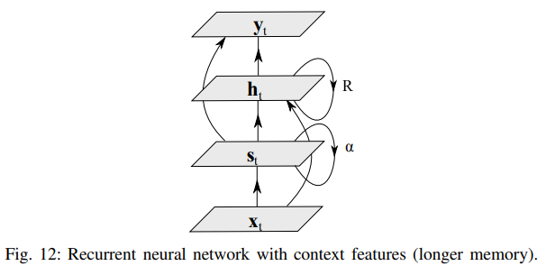

### 6.9 酉循环神经网络

减缓梯度消失与梯度爆炸的一个简单方法是使用 RNN 中的酉矩阵（unitary matrices）。梯度消失与梯度爆炸问题归因于隐藏到隐藏权重矩阵的特征值之一的偏离。因此，为了防止这些特征值偏离，可用酉矩阵取代网络中的一般矩阵。

### 6.10 门控正交循环单元（Gated Orthogonal Recurrent Unit）

门控正交循环单元使用正交矩阵取代隐藏状态循环矩阵（loop matrix），并引入了对 ReLU 激活函数的增强，使得它能够处理复数值输入。这种单元能够使用酉矩阵捕捉数据的长期依赖关系，同时还能利用 GRU 架构中的遗忘机制。

### 6.11 层级子采样循环神经网络

层级子采样循环神经网络（HSRNN) 旨在通过使用固定的窗口大小进行每个层级的子采样，从而更好地学习长序列。训练这种网络遵循常规 RNN 训练的流程，然后根据每个层级的窗口大小进行略微修改。
