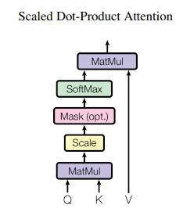
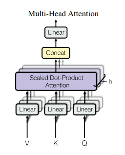
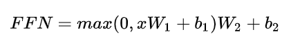

# Transformer

## 1. Transformer架构

### 1.1 总体框架

上图所示为Transformer 的架构。和经典的 seq2seq 模型一样，Transformer 模型中也采用了 encoer-decoder 架构。上图的左半边用 **NX** 框出来的，就代表一层 encoder，其中论文里面的 encoder 一共有6层这样的结构。上图的右半边用 **NX** 框出来的，则代表一层 decoder，同样也有6层。

定义输入序列首先经过 word embedding，再和 positional encoding 相加后，输入到 encoder 中。输出序列经过的处理和输入序列一样，然后输入到 decoder。

最后，decoder 的输出经过一个线性层，再接 Softmax。

于上便是 Transformer 的整体框架，下面先来介绍 encoder 和 decoder。

### 1.2 Encoder

encoder由 6 层相同的层组成，每一层分别由两部分组成：

*   第一部分是 multi-head self-attention

*   第二部分是 position-wise feed-forward network，是一个全连接层

两个部分，都有一个残差连接(residual connection)，然后接着一个 Layer Normalization。

### 1.3 Decoder

和 encoder 类似，decoder 也是由6个相同的层组成，每一个层包括以下3个部分:

*   第一个部分是 multi-head self-attention mechanism

*   第二部分是 multi-head context-attention mechanism

*   第三部分是一个 position-wise feed-forward network

和 encoder 一样，上面三个部分的每一个部分，都有一个残差连接，后接一个 **Layer Normalization**。

decoder 和 encoder 不同的地方在 multi-head context-attention mechanism

### 1.4  Attention

Attention 如果用一句话来描述，那就是 encoder 层的输出经过加权平均后再输入到 decoder 层中。它主要应用在 seq2seq 模型中，这个加权可以用矩阵来表示，也叫 Attention 矩阵。它表示对于某个时刻的输出 y，它在输入 x 上各个部分的注意力。这个注意力就是我们刚才说到的加权。

Attention 又分为很多种，其中两种比较典型的有加性 Attention 和乘性 Attention。加性 Attention 对于输入的隐状态h\_t和输出的隐状态 s\_t直接做 concat 操作，得到\[s\_t; h\_t]，乘性 Attention 则是对输入和输出做 dot 操作。

Transformer使用的是乘性 Attention.

### 1.5 Self-Attention

上面我们说attention机制的时候，都会说到两个隐状态，分别是h\_i和s\_t。前者是输入序列第 i个位置产生的隐状态，后者是输出序列在第 t 个位置产生的隐状态。所谓 self-attention 实际上就是，输出序列就是输入序列。因而自己计算自己的 attention 得分。

### 1.6 Context-Attention

context-attention 是 encoder 和 decoder 之间的 attention，是两个不同序列之间的attention，与来源于自身的 self-attention 相区别。

不管是哪种 attention，我们在计算 attention 权重的时候，可以选择很多方式，常用的方法有

*   additive attention

*   local-base

*   general

*   dot-product

*   scaled dot-product

Transformer模型采用的是最后一种：scaled dot-product attention。

### 1.7 Scaled Dot-Product Attention

通过 query 和 key 的相似性程度来确定 value 的权重分布。论文中的公式长下面这个样子：

K、Q、V 分别代表什么：

*   在 encoder 的 self-attention 中，Q、K、V 都来自同一个地方，它们是上一层 encoder 的输出。对于第一层 encoder，它们就是 word embedding 和 positional encoding 相加得到的输入。

*   在 decoder 的 self-attention 中，Q、K、V 也是自于同一个地方，它们是上一层 decoder 的输出。对于第一层 decoder，同样也是 word embedding 和 positional encoding 相加得到的输入。但是对于 decoder，我们不希望它能获得下一个 time step (即将来的信息，不想让他看到它要预测的信息)，因此我们需要进行 sequence masking。

*   在 encoder-decoder attention 中，Q 来自于 decoder 的上一层的输出，K 和 V 来自于 encoder 的输出，K 和 V 是一样的。

*   Q、K、V 的维度都是一样的，分别用d\_Q，d\_K和d\_V来表示

*   Google 论文的主要贡献之一是它表明了内部注意力在机器翻译 (甚至是一般的Seq2Seq任务）的序列编码上是相当重要的，而之前关于 Seq2Seq 的研究基本都只是把注意力机制用在解码端。

### 1.8 Multi-head attention

理解了 Scaled dot-product attention，Multi-head attention 也很容易理解啦。论文提到，他们发现将 Q、K、V 通过一个线性映射之后，分成 h 份，对每一份进行 scaled dot-product attention 效果更好。然后，把各个部分的结果合并起来，再次经过线性映射，得到最终的输出。这就是所谓的 multi-head attention。上面的超参数 h 就是 heads 的数量。论文默认是 8。

multi-head attention 的结构图如下所示。

值得注意的是，上面所说的分成 h 份是在d\_Q、d\_K和d\_V的维度上进行切分。因此进入到scaled dot-product attention 的d\_K实际上等于未进入之前的D\_K/h

Multi-head attention 的公式如下：

其中，

在论文里面，d\_model = 512，h = 8，所以在 scaled dot-product attention 里面的

可以看出，所谓 Multi-Head，就是只多做几次同样的事情，同时参数不共享，然后把结果拼接。

### 1.9 Layer normalization

> Normalization 有很多种，但是它们都有一个共同的目的，那就是把输入转化成均值为 0 方差为 1 的数据。我们在把数据送入激活函数之前进行 normalization（归一化），因为我们不希望输入数据落在激活函数的饱和区。

说到 normalization，那就肯定得提到 Batch Normalization。

BN 的主要思想就是：在每一层的每一批数据上进行归一化。我们可能会对输入数据进行归一化，但是经过该网络层的作用后，我们的数据已经不再是归一化的了。随着这种情况的发展，数据的偏差越来越大，我的反向传播需要考虑到这些大的偏差，这就迫使我们只能使用较小的学习率来防止梯度消失或者梯度爆炸。

### 1.10 Mask

mask 表示掩码，它对某些值进行掩盖，使其在参数更新时不产生效果。Transformer 模型里面涉及两种 mask，分别是 padding mask 和 sequence mask。

其中，padding mask 在所有的 scaled dot-product attention 里面都需要用到，而 sequence mask 只有在 decoder 的 self-attention 里面用到。

#### 1.10.1 Padding Mask

什么是 padding mask 呢？因为每个批次输入序列长度是不一样的也就是说，我们要对输入序列进行对齐。具体来说，就是给在较短的序列后面填充 0。因为这些填充的位置，其实是没什么意义的，所以我们的 attention 机制不应该把注意力放在这些位置上，所以我们需要进行一些处理。

具体的做法是，把这些位置的值加上一个非常大的负数(负无穷)，这样的话，经过 softmax，这些位置的概率就会接近0！

而我们的 padding mask 实际上是一个张量，每个值都是一个 Boolean，值为 false 的地方就是我们要进行处理的地方。

#### 1.10.2 Sequence mask

sequence mask 是为了使得 decoder 不能看见未来的信息。也就是对于一个序列，在 time\_step 为 t 的时刻，我们的解码输出应该只能依赖于 t 时刻之前的输出，而不能依赖 t 之后的输出。因此我们需要想一个办法，把 t 之后的信息给隐藏起来。

那么具体怎么做呢？也很简单：**产生一个上三角矩阵，上三角的值全为 1，下三角的值****全为****0，对角线也是 0**。把这个矩阵作用在每一个序列上，就可以达到我们的目的啦。

*   对于 decoder 的 self-attention，里面使用到的 scaled dot-product attention，同时需要padding mask 和 sequence mask 作为 attn\_mask，具体实现就是两个 mask 相加作为attn\_mask。

*   其他情况，attn\_mask 一律等于 padding mask。

### 1.11 Positional Embedding

现在的 Transformer 架构还没有提取序列顺序的信息，这个信息对于序列而言非常重要，如果缺失了这个信息，可能我们的结果就是：所有词语都对了，但是无法组成有意义的语句。

为了解决这个问题。论文使用了 Positional Embedding：对序列中的词语出现的位置进行编码。

在实现的时候使用正余弦函数。公式如下：

其中，pos 是指词语在序列中的位置。可以看出，在**偶数位置，使用正弦编码，在奇数位置，使用余弦编码**。

从编码公式中可以看出，给定词语的 pos，我们可以把它编码成一个d\_model的向量。也就是说，位置编码的每一个维度对应正弦曲线，波长构成了从2Π到10000\*2Π的等比数列。

上面的位置编码是**绝对位置编码**。但是词语的**相对位置**也非常重要。这就是为什么要使用三角函数的原因！

### 1.12 Position-wise Feed-Forward network

这是一个全连接网络，包含两个线性变换和一个非线性函数(实际上就是 ReLU)。公式如下

这个线性变换在不同的位置都表现地一样，并且在不同的层之间使用不同的参数。

### 参考

[https://arxiv.org/pdf/1706.03762.pdf](https://arxiv.org/pdf/1706.03762.pdf "https://arxiv.org/pdf/1706.03762.pdf")
