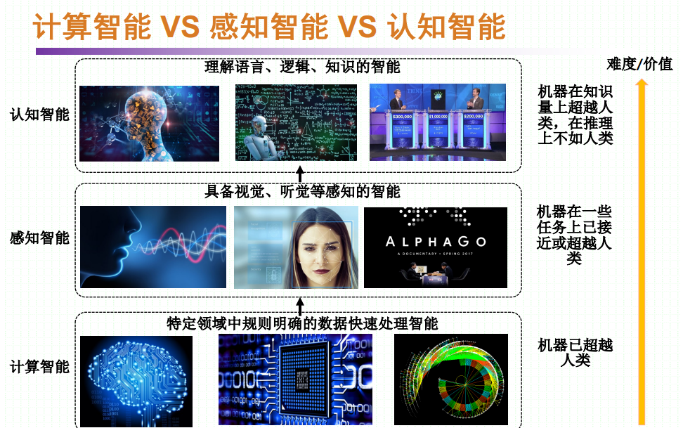
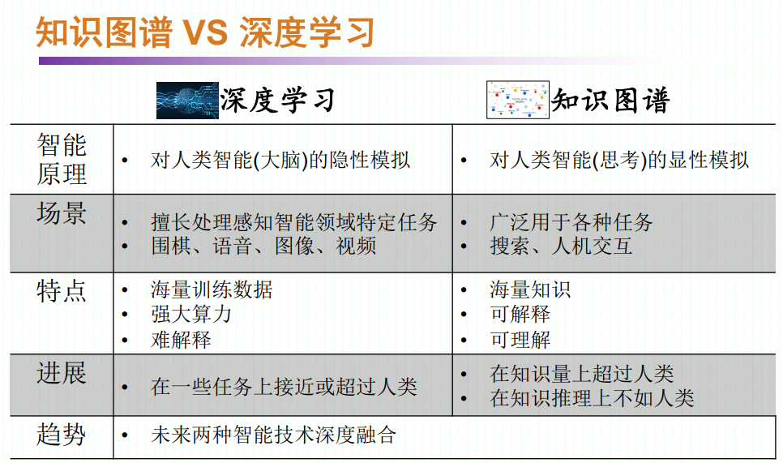
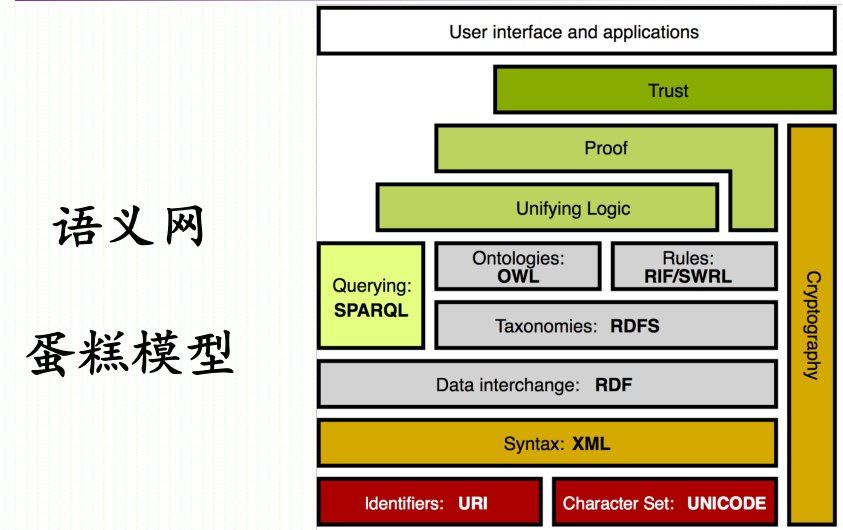
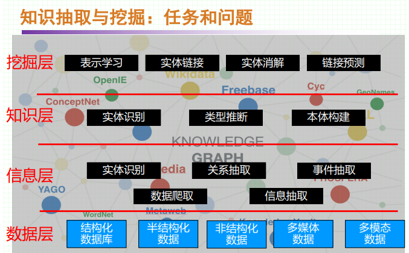

# 知识图谱概述

## 1. 人工智能的3个发展阶段：

- 计算智能：计算机超过人类
- 感知智能：让计算机拥有视觉和听觉等感知智能
- 认知智能：与人类语言、知识、逻辑相关的智能

知识图谱：推动感知智能走向认知智能的重要力量

## 2. 什么是知识图谱

- 谷歌：not strings, but things.（万物及其联系的网络）
- 知识图谱是一项实用的人工智能前沿技术，是认知智能的核心技术之一
## 3. 知识图谱VS 深度学习

## 4. 知识图谱发展（信息组织方式发展）

- 1956 语义网络
	- 最初目的用于语言翻译和自然语言处理
	- 表示概念间语义关系的网络
	- 经典语义网络项目：WordNet
- 1970 关系数据库
- 1980 本体Ontology
- 1989 万维网（文档+链接）
- 1999 语义网
	
	- 本体（Ontology）：领域共享知识的描述方式，是语义Web、语义搜索、知识工程和很多人工智能应用的基础。本体是语义网知识描述的载体。
	- 描述逻辑：描述逻辑是一种知识表示语言，表达能力强于命名逻辑，弱于一阶逻辑。描述逻辑成为语义网的逻辑基础，其推理具有正确性和完备性保证。其发展过程先后制定了基于描述逻辑的不同语言规范：DAML、RDF、OWL等
- 2006 链接数据
- 2012 知识图谱（实体+链接）

## 5. 知识图谱用途

### 5.1 数据视角

- 结构化数据：查询/搜索、统计、分析、挖掘
- 图数据：查询/搜索、可视化、图分析/挖掘、推荐
- 知识：重用、认知（语义理解、解释、推理、理性）

### 5.2 应用场景

- 辅助搜索-精准问答：提高搜索精度、意图理解
- 辅助搜索-人机互动：提高问答精度、体验、引导对话、多轮对话
- 辅助数据集成-智能数据整合：大规模多源异构数据集成、建立和挖掘数据内在关联、知识重用、可拓展性强、形式灵活（数据-信息-知识）
- 辅助决策-智能决策：辅助自然语言理解
## 6. 知识图谱核心价值
- 集成异构数据源
- 描述数据间的关联
- 实现实体链接
- 大规模知识推理

## 7. 知识图谱工程体系

## 8.  知识图谱案例

### 8.1 通用知识图谱

- Cyc（Douglas Lenat, 1984）
- WordNet（词典知识库，语义消歧）
- ConceptNet（常识知识库）
- Freebase（开源知识库）
- wikidata（人人可编辑的知识库）
- DBPedia（RDF语义网项目）
- YAGO
- NELL（卡内基梅隆大学的自学习知识库）
- OpenIE
- ZhiShi.me
- CN-DBPedia
- BabelNet（多语言字典知识库）
- Google Knowledge Graph（检索结果融合了知识）
- Facebook Graph Search（超越传统关键词的搜索能力）
- 微软Concept Graph（概念层次知识图谱）
- Amazon Product Graph
- 路透社知识图谱
- LinkedIn 知识图谱
- 阿里巴巴知识图谱（商品知识、语义搜索、反欺诈、智能客户、天猫精灵、导购、推荐）
- 美团知识图谱（美团大脑）
- 百度知识图谱（实体知识图谱：精准问答；关注点知识图谱：文本理解；意图知识图谱：人机对话）
### 8.2 领域知识图谱
- IBM Watson问答系统
- 国家863超脑计划——高考机器人
- 金融知识图谱
	- 金融知识搜索与智能问答
	- 金融事件关联分析
	- 辅助信贷审查：多源信息整合
	- 金融反欺诈：发现诈骗团伙间隐含关系
- 商业情报知识图谱
- 医学知识图谱
	- H-Graph：辅助医疗诊断
	- 阿里医知鹿：辅助抑郁症治疗
	- 大经中医：中医药知识传承与临床辅助
- 学术知识图谱
	- 华盛顿大学Semantic Scholar：学者和论文智能搜索
	- 清华：Aminer：专家搜索
- 人文历史知识图谱
	- 唐诗别苑：唐诗的语义搜索
- APP知识图谱
	- Andro Vault：Android应用程序知识图谱，软件安全评估，恶意代码族谱分析
- 情报知识图谱
	- 港独分子分析
	- 非法集资分析
	- 团伙挖掘
	- 军事：本拉登藏身定位；麦道夫庞氏骗局；国际关系分析；作战资源分析；重要军事设施分析；空中力量分析；指挥体系分析；领导人分析
- 辅助智能制造
	- Siemens：匹配最合适的参数，减小损耗；匹配用户需求；同一元数据标准；文档
