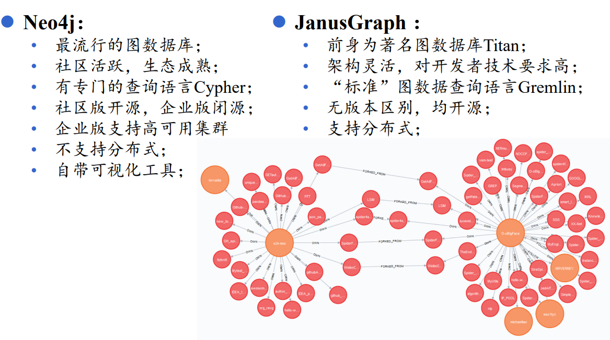
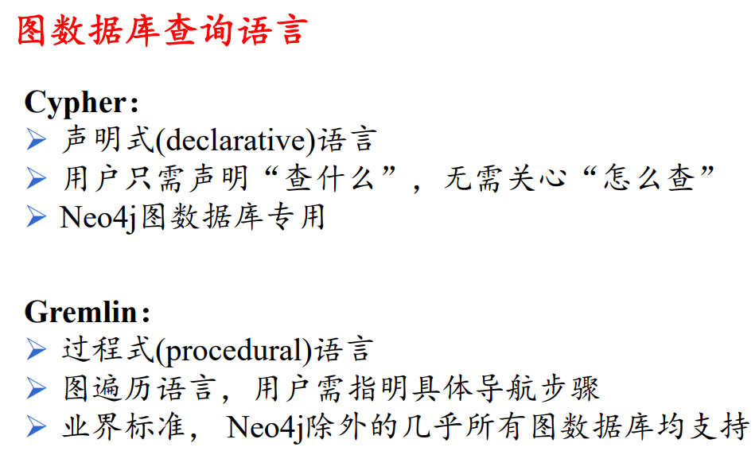
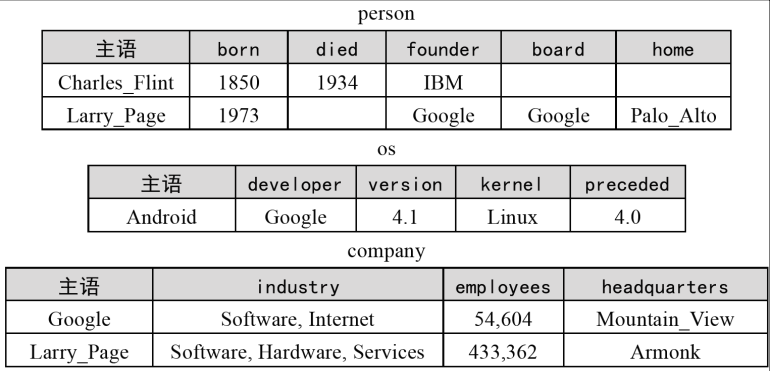

# 知识存储

## 1. 知识存储概述

### 1.1 什么是知识存储

- 在抽取的知识和建模表示后，对知识进行持久化存储
### 1.2 知识存储的场景分类
- 实验阶段的小规模知识图谱多使用文件对知识进行存储
- 面临大规模知识图谱的查询、修改、推理时等需求时，需要考虑使用**数据库管理系统（DBMS）**对知识进行存储。 
### 1.3 常用的数据库管理系统

- 关系型数据库管理系统（Relational DBMS）
- 图数据库管理系统（Graph DBMS）- 图数据模型
- RDF存储系统（RDF Stores）- 图数据模型
	

### 1.4 数据库管理系统选择要素

- 需要根据具体的数据规模及应用场景选则合适的存储模型
- 绝大多数应用场景不涉及多跳查询，此时用关系型数据库即可
- 当应用涉及多跳查询、计算最短路径、推理分析等需求时，图数据库和RDF数据库的优势才凸显出来
## 2. 图数据库管理系统

### 2.1 关于图数据库

- 图结构数据、图论算法的广泛运用，生物信息学、社交网络分析等研究领域也产生了对大规模图结构数据进行管理的需求，因此数据库领域发展出专门用于管理图结构数据的图数据库管理系统（Graph DBMS）
### 2.2 常见图数据库

### 2.3 流行的图数据库及其检索语言

## 3. RDF存储系统

### 3.1 关于RDF存储系统

- 万维网联盟（W3C）提出使用RDF资源描述框架来描述语义网中的资源并形式化地表示资源间的隐含语义关系。为此，万维网研究领域发展出专门用于存储RDF数据的RDF存储系统（RDF Store）。
- RDF用三元组的结构来描述资源。每个三元组由主语、谓语、宾语这样的三种元素构成。
- 根据RDF标准，每个三元组称为陈述（Statement），多个语句的集合称为描述（Description）
- RDF三元组集合可以看作图数据的一种表示，所以RDF存储系统可以认为是一种严格遵循语义网标准的图数据库。

### 3.2 常见的RDF存储系统

### 3.3 RDF查询语言SPARQL

- 声明式语言
- 由W3C制定的RDF标准查询语言
- 被认为是语义网技术的关键
- 所有RDF存储系统都以SPARQL作为查询语言
## 4. 基于关系型数据库的存储方案

### 4.1 为什么要用关系型数据库

- 在关系型数据库上设计合适的存储方案，同样能实现对 图数据库的存储
- 关系型数据库的技术和方案都特别成熟，一些RDF三元组库是基于其实现的
- 涉及图的全局操作时，图数据库和三元组数据库的性能往往不如传统的关系型数据库
### 4.2 方案1：三元组表
- 每个三元组作为表中的一行记录
- 多跳查询时会产生自链接（Self-join）操作

### 4.3 方案2：水平表

- 每行 存储一个主语对应的所有谓语和宾语
- 只适用于谓词数量较少的知识图谱
- 对于一个主语，可能在极少列上有值，造成稀疏
- 无法存储多值属性或一对多联系

### 4.3 方案3：属性表

- 相当于对水平表的切分
- 将不同类型实体存入不同的表中
- 应用于实体总类较少的情况
- 无法存储多值属性或一对多联系
- 是一种常见的存储方案

### 4.4 方案4：垂直划分

- 相当于对三元组表按谓词进行划分
- 为每种谓词创建一张两列的表
- 可以存储多值属性或一对多联系
- 涉及多个谓词的查询将导致多表连接操作

