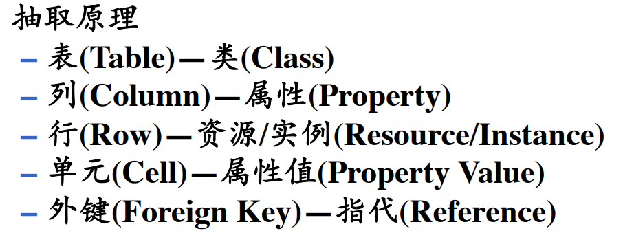

# 知识抽取

## 1. 知识抽取的场景

### 1.1 （半）结构化文本数据

- 百科知识中的Inforbox、规范的表格、数据库、社交网络......
	

### 1.2 非结构化文本数据

- 网页、新闻、社交媒体、论文 .......
	

### 1.3 多媒体数据

- 图片、视频
	

## 2. 知识抽取的挑战

- 知识的不明确性（一词多义）
- 知识的不完备性（关系、实体、属性缺失）
- 知识的部一致性（多次一义）
## 3. 关系数据库抽取知识

### 3.1 抽取原理

### 3.2 关系数据库抽取优点

- 转换 规则简单，易于实现
### 3.3 关系数据库抽取缺点
- 直接转换得到的知识库语义信息不足
- 需要熟悉原设计数据库的专家辅助进行知识库优化

## 4. 从半结构化数据抽取知识

## 5. 从非结构化数据抽取知识
- 是当前知识图谱构建的瓶颈
- 关键技术
	- 实体识别：抽取文本中的原子信息
	- 关系抽取：抽取实体间的语义信息
	- 事件抽取：抽取事件信息，如地点、时间、原因、参与者等
