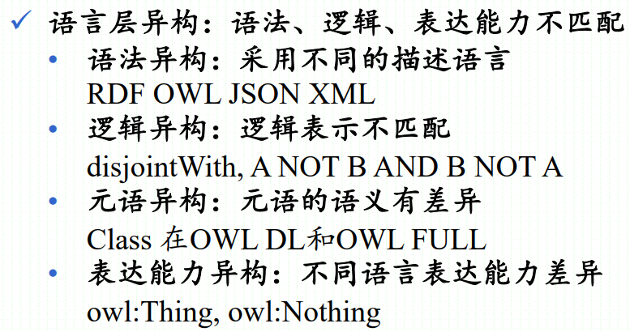
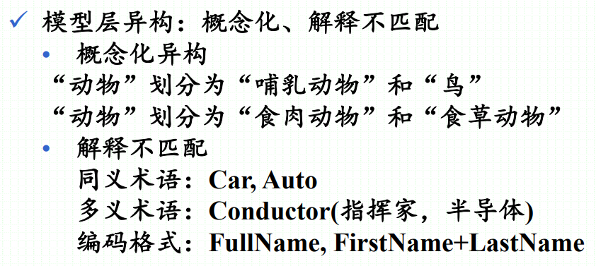
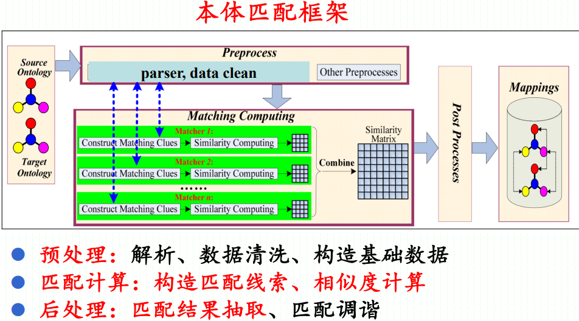
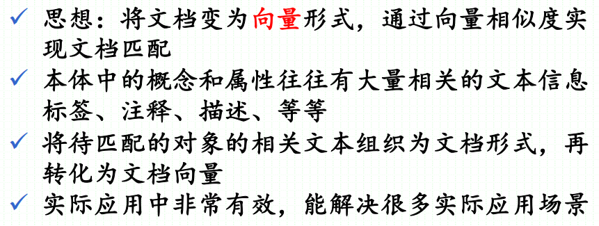
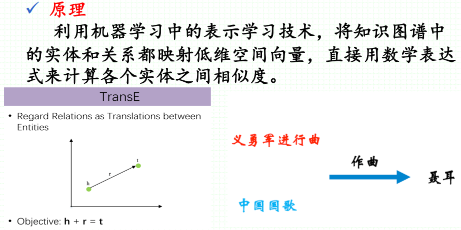
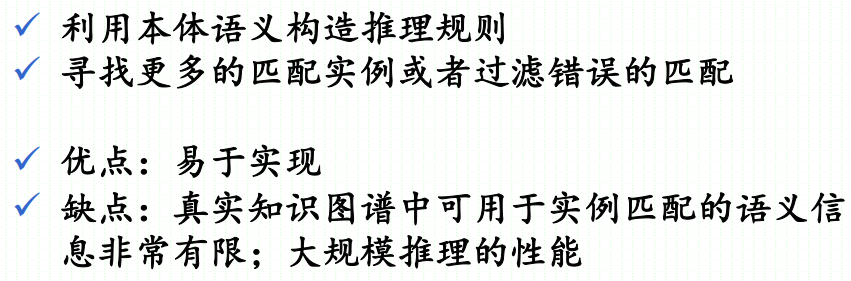
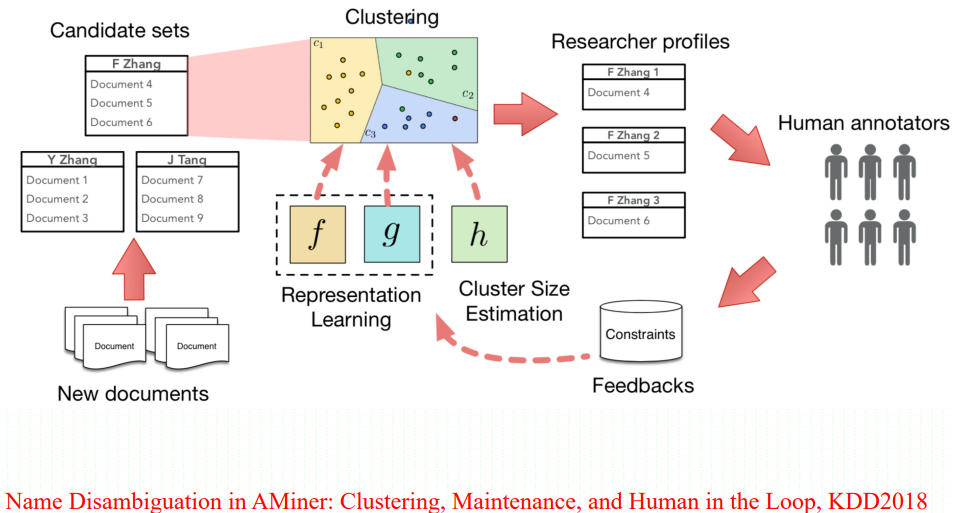

# 知识融合

## 1. 知识图谱的异构

### 1.1 从知识图谱构建的角度看

- 早期知识工程的理想是构建一个统一的知识库
- 人类知识体系复杂
- 不同人对某些知识有主观看法
- 知识会随时间自然演化
- 同一领域有不同组织构建自己的知识库
- 交叉领域的交叉知识往往是独立构建
- 知识图谱构建优先考虑重用现有知识
### 1.2 从知识图谱应用的角度看
- 不同领域的系统需要进行交互
- 系统处理的知识来自不同领域
### 1.3 知识异构的两个层次

#### 1.3.1 语言层异构

#### 1.3.2 模型层异构

## 2. 为什么需要知识融合

### 2.1 数据清洗

- 构建的知识图谱可能存在异构
- 知识融合是知识图谱应用的重要预处理步骤
### 2.2 数据集成
- 需要同时利用或融合多个不同来源的知识图谱
	
- 不同源的知识图谱可能存在重叠的知识
## 3. 解决本体层的匹配（Ontology Matching）

### 3.1 基础匹配器（字符串匹配器）

- 编辑距离

- Levenshtein distance（最小编辑距离）

- Wagner and Fisher distance（Levenshtein distance拓展）

- 汉明距离

- 字串相似度

- Dice系数

- Jaccard系数

- 基于N-gram的集合相似度

### 3.2 文本匹配方法

- TF/IDF（提取关键字词向量）

### 3.3 结构匹配方法

- 间接的结构匹配器

- 在文档匹配器中考虑结构信息，如邻居、上下义、属性等

- 直接的结构匹配器

- 图匹配复杂度高，无法直接使用

- **相似度传播模型**的各种变体很有效

### 3.4 知识表示学习方法

## 4. 解决实例层的匹配（Instance Matching）

### 4.1 实例术语解析

不同领域的称谓

- 实例（Instance）：知识工程领域
- 实体（Entity）：自然语言处理
- 记录（Record）：数据库
- 对象（Object）：知识工程领域
### 4.2 实例匹配

不同领域称谓

- Instance Matching（实例匹配）：知识工程领域（知识图谱、语义Web）
- Entity Resolution/Coreference（实体解析）：自然语言处理领域、数据库领域
- Record Linkage（记录链接）：自然语言处理领域、数据库领域
- Duplicate Detection（重复检测）：数据库领域
- Name Disambiguation（名字消解）：数字图书馆、社交网络
### 4.3 实例匹配的挑战
1. 一词多义
2. 多次一义
3. 匹配效果和匹配性能
	1. 真实知识图谱规模大
	2. 匹配效果和匹配性能如何平衡
	3. 时间复杂度和空间复杂度都重要

### 4.4 实例匹配的方法

#### 4.4.1 基于推理的匹配方法

#### 4.4.2 基于实例对的相似度匹配

#### 4.4.3 基于机器学习的匹配方法

#### 4.4.4 基于分块的大规模实例匹配

#### 4.4.5 基于推理的实例匹配方法

#### 4.4.6 基于学习的实例匹配方法

