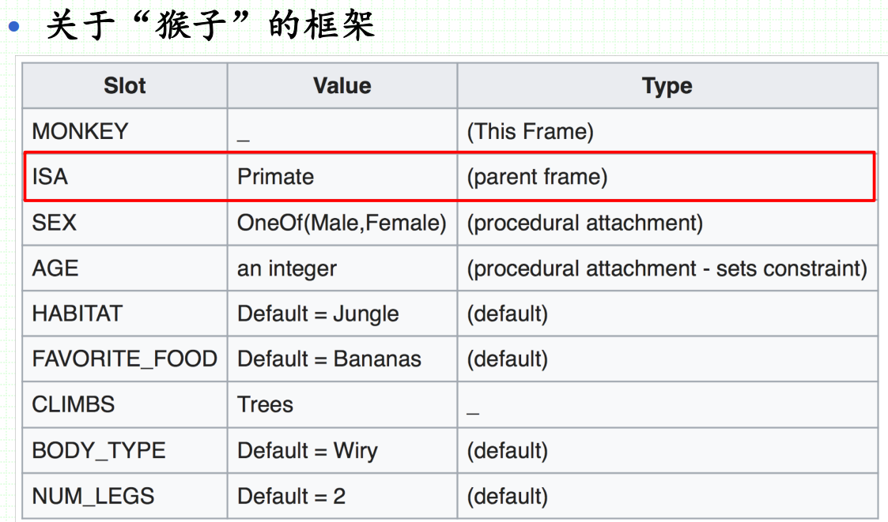
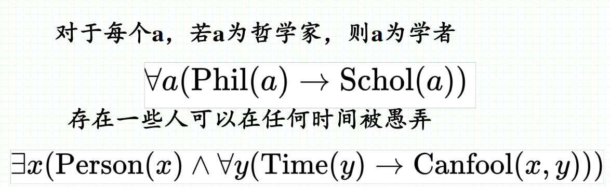
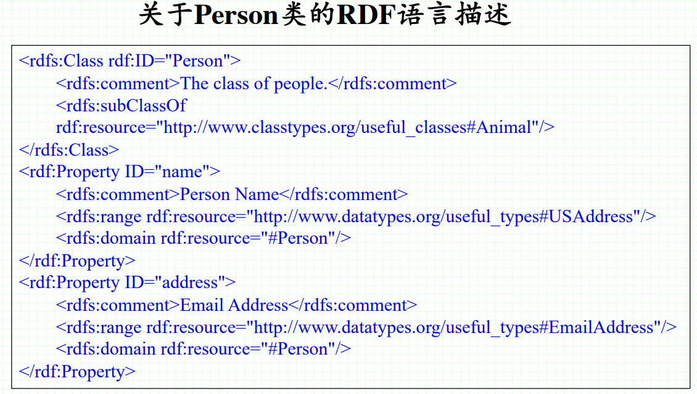
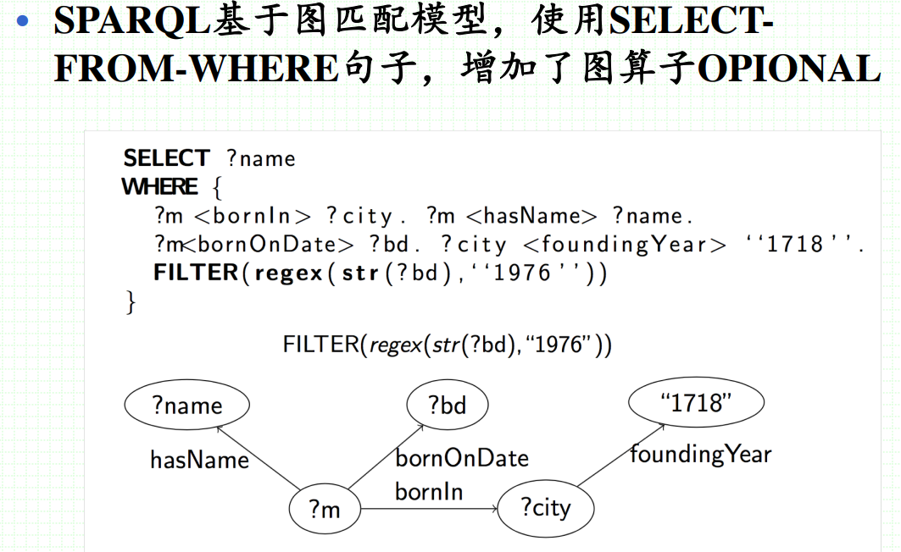
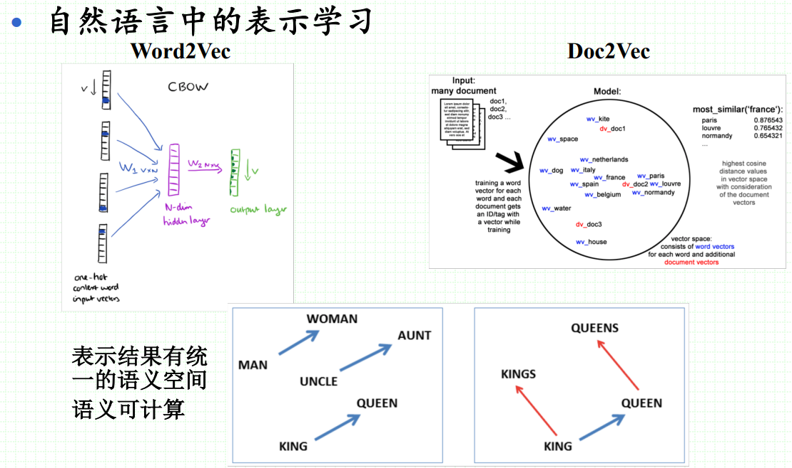

# 知识表示

## 1. 什么是知识表示

- 知识表示是认知科学和人工智能两个领域共同存在的问题。在人工智能里表示如何储存知识，让程序能够处理，达到人类的智慧。
- 知识表示是将关于世界的信息表示为符合机器处理的模式，用于模拟人对世界的认识和推理，以解决人工智能中的复杂任务。
## 2. 知识表示方法

### 2.1 语义网络（1960-1970）

- 由节点和边构成
	

### 2.2 产生式规则（1970-1980）

- 行为规则的集合，一条规则包括前提（IF）和动作（THEN）两部分
	

### 2.3 框架系统（1980-1990）

- 框架是知识表示的基本单位，描述对象属性的数据结构。一个框架分为若干个槽，一个槽分为若干个侧面。槽描述属性，侧面一般是属性值
	

### 2.4 描述逻辑（1990-2000）

- 一阶逻辑，有断言、量化和公理的逻辑接口；很多一阶逻辑是可靠和完备的演绎系统。
- 描述逻辑以结构化和易理解的形式来表示领域需求，是语义网的逻辑基础。
	

### 2.5 语义网（2000-2010）

- RDF（Resource Description Framework）
	
- RDFS（Resource Description Framework Schema）
- OWL（Ontology Web Language）
- SPARQL
	
- JSON-DL（JSON For Linked Data）
	

### 2.6 统计表示（2013-）

- 表示形式为向量，能够被各种机器学习模型直接使用，包括词袋，word2vec，BERT词嵌入等。
	
