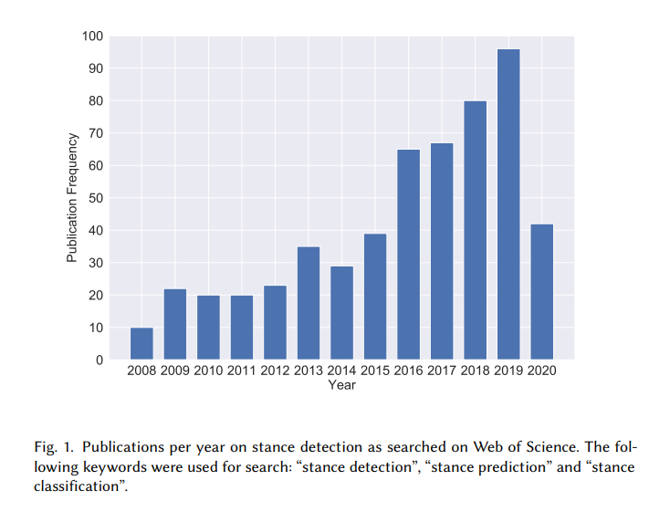
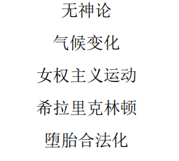

# 立场检测研究

## 1. 研究动机

- 随着web2.0时代的到来，社交媒体开始在社会生活中流行开来。微博是一种基于用户关系的信息分享、传播以及获取平台，用户可以通过各种渠道进入社区，以短文本的形式更新信息，并实现即时分享。作为社交媒体的一种，微博依靠其巨大的用户基数和强大的用户粘性成为了当下社会的重要信息源。**巨大的用户基数和快速的信息传播速度使得微博平台的谣言能够对公共安全构成极大的潜在危害**。例如，2011-03-11，日本福岛核电站因地震发生核泄漏，一周以后，关于食盐可以保护人们免受辐射的谣言开始在微博上广泛传播，引起了多个地区大规模的食盐抢购潮，造成了社会的恐慌，严重影响了社会的稳定。
- 以微博为代表的社交媒体文本是人们表达情感、发表评论最便捷的工具之一，微博文本中通常包含较强的个人立场倾向等主观信息，**此类文本数据中往往蕴含着对产品、服务、政策和新闻等的宝贵反馈,能够为决策者提供来自于公众的、与其关注目标相关的意见数据**，如何使用自动化手段对立场信息进行分析和解读成为研究者关注的重要问题。

## 2. 关于立场检测

### 2.1 什么是立场检测

文本立场检测是指从用户发表的文本中自动判断其对于预先给定目标的立场。文本立场检测与文本情感分析是文本意见挖掘领域的重要研究方向,与文本情感分析不同的是,文本立场检测需要判别表达方式更为复杂的“支持、反对或中立”的立场,而不是对指定对象的积极或消极的情感极性。在社交媒体分析研究中，情绪和立场之间存在明显的误解。一些研究使用情绪分析仪作为衡量给定目标支持度的主要方法，这是次优的。情感通常作为立场表达的载体,**同一立场可以通过不同的情感来表达**。

**对象+情感 = 立场**（有消融实验支撑，失去两个方面的特征对精度的影响都很大）

重要性：对象>情感

情感分析主要被视为一项语言不可知任务，其重点是利用给定文本的语言属性来识别文本的极性，而立场检测可以通过利用非文本特征（如网络和上下文特征）来推断用户的立场，从而采用另一种范式。

**最早是为了进行舆情监控而出现**，2006年Thomas等人收集了2005年美国国会发言辩论记录,并进行支持与反对立场的标注,随后

,不同角度的文本立场检测研究工作相继出现。

SemEval 2016姿态检测任务[3]的发布有关，该任务为社交媒体上的姿态检测提供了第一个基准数据集。

难点：

- 立场在文本中通常是不透明的，但有时必须从互动和历史背景的组合中含蓄地推断出来。

### 2.2 应用领域

商业智能（确定消费者对新产品的反应和提升用户体验）、

舆情分析（公共事件民众立场分析）、

政治选举（民众立场分析）、

医疗决策和心理健康（抑郁症检测）、

对话系统（结合文本立场的回答生成）、

个性化推荐（根据用户对商品的立场）、

谣言验证（结合综合立场的统计or分类（网络空间安全））、

社会感知等研究领域,具有重要的学术研究与应用价值．

### 2.3 问题分类

#### 2.3.1 按目标类型

- 单目标（常见，适用性广，应用价值较高）：给定单一的文本(推特、微博、新闻文章、辩论文本等)以及目标,需要确定文本对给定的目标的态度是支持、反对或者中立
- 多目标：多目标立场检测与单目标立场检测相似, 给定文本和K个相关的目标,需要确定文本对给定K个目标的立场,区别在于其中一个目标的预测对其他目标的预测可能有潜在影响（研究较少）

#### 2.3.2 按文本粒度

- 句子级别（短文本，语义信息少）：引入迁移学习的思想
- 篇章级别：判断新闻文章对标题的立场（Pomerleau等人在2017年提出虚假新闻检测任务,并将立场检测作为该任务的第一阶段）
- 辩论文本：本人未见

## 3. 语料问题和任务问题

### 3.1 微博

面对立场判别问题，对中文微博进行立场判别的难度大于英文微博，主要原因有： 

- **分词是中文文本分析的关键步骤**，分词结果的好坏将直接影响模型的准确度；
- **微博的表达方式较为随意**，微博作者针对某一个话题常常会自动生成一些相关的网络用语和昵称，比如 “土鸡”“烧高香”“坑人”等；
- **微博文本语义关系更加隐晦**，有研究表明，传统的依存句法分析方法并不适合提取微博文本的评价对象和评价词。（但大家还是用）

例如，针对话题“深圳禁摩限电”而言，其相关文本“最反感这些拉客的！还有在机动车道上行驶的”的情感极性是消极的，而且该文本中没有显式出现特定话题信息，无法单独根据文本判断其立场倾向，但结合了话题信息后，检测该文本的立场倾向性是支持的。因此，**捕捉文本中与对应话题的相关特征是立场检测任务的重点。**

另外，挖掘并结合文本中蕴含的情感信息已被证明有助于提高立场检测的结果。（提高情感信息的输入权重有利于提升立场检测的结果）

## 4. 开放任务数据集

- CCF国际自然语言处理与中文计算会议NLPCC2016Task4 （中文）
	
- 国际语义评测大会SemEval-2016Task 6 （英文）
	
- Fake News Challenge Stage 1 （英文）：提供了用于评估新闻文章对于标题的立场分析任务的篇章级数据
- IberEval-2017（evaluation of human language technologies）评测：针对“加泰罗尼亚的独立”包含西班牙语和加泰罗尼亚语的双语Twitter文本检测数据集、以及由土耳其语、阿拉伯语、捷克语、英语-印地语、意大利语、俄语、日语等小语种构成的立场检测数据集
- Sobhani构建的Multi-Target Stance Detection数据集
- H&N14 【HASAN K S, NG V. Why are You Taking this Stance? Identifying and Classifying Reasons in Ideological Debates [C] //Proceedings of the 2014 Conference on Empirical Methods in Natural Language Processing. 2014:751-762. 】

## 5. 常用方法

### 5.1 基于规则

- 基于情感规则的分析。通过借助情感词典等资源提取文本中的情感因子，并考虑情感因子与特征对象的依存关系，对倾向值进行简单统计从而得到文本整体的情感倾向。

但是这类方法往往不能捕捉到隐含的文本语义关系。

### 5.2 基于特征工程的机器学习方法（2014-

从微博话题文本中提取出有关情感和主题的词汇，然后将这些词汇作为特征词，并使用Word2Vec进行词向量的训练，再将词向量求平均后，作为该文本的特征传给SVM分类器中进行立场检测的立场倾向分类。

相关实验表明，当文本特征分析仅使用情感词时，情绪并不能准确地反映作者的立场倾向，其立场分类效果并不理想，而加入主题和情感的相关词汇共同作为特征时的选取效果更好。一些学者也探究了文本的多种特征，诸如基于同义词典的词袋特征、文本的Word2Vec的字向量和词向量等不同的特性交叉组合，分析其对立场检测的影响，并且分别使用SVM、随机森林以及决策树对进行立场分类。实验表明，对于立场分类结果，词与立场标签的共现关系同Word2Vec的字与词向量的组合的改善最为明显。

主要特征

- 基于语义特征（词袋模型和字向量、词向量）
- TF-IDF
- 主题模型特征（LDA、LSA）
- 形态特征（时间序列和传播结构）
- 情感特征（情感系数）
- 语法特征（依赖关系、句法规则）

优点

- 具有很强的可解释性和有效性

缺点

- 但需要大量的人工和先验知识来构造和选择特征，往往对语言学知识具有较高要求
- 经常受到训练样本不足导致的特征稀疏的影响。
- 不能很好地考虑到句式以及上下文因素的影响。

该领域目前前沿的做法：

- 利用不同的特征和分类算法进行立场检测时，会产生不同的子分类器。在进行后期融合时，使用不同子分类器对样本预测概率的加权平均作为最终的立场判断的预测概率，并选择预测概率最大的立场类别作为最终的立场标签。

**大杂烩**做法：

### 5.3 基于深度学习

以Word2Vec为代表的词向量模型的出现，简化了深度学习模型的输入表示，使深度学习神经网络技术在自然语言中更加有效在处理领域取得了重大突破。作为机器学习的一个重要分支，深度学习可以自动学习合适的特征和多层次的表达输出。现有的深度学习框架大多是端到端的构造方法，这减少了构造特征的过程，减少了人为错误，立场检测的研究重点已经开始偏向深度学习的使用。

- 缺点：往往直接将立场分析视为简单的文本分类问题，很少结合社交媒体文本词嵌入中的背景知识，也没有有效利用立场分析中特定话题的信息。
- 优点：基于深度学习的方法可以将稀疏词表示变为稠密、连续、低维的向量。无需手动定制特征，省去了复杂的特征工程部分

目前，在有关立场检测的现有研究中，基于深度学习的工作主要有2种主流的思路

1. 通过使用不同方式将目标话题信息添加到微博文本内容中来提升立场检测效果
2. 从语言学的角度，对深度学习模型的结构进行创新，使得模型能够学习到文本的句意信息，从而达到更为精准的立场检测结果。

主流步骤过程：

- 获得文本的矢量表示（词嵌入）
- 提取局部特征（CNN、LSTM、RNN、BiLSTM......）
- 使用注意机制为局部特征添加影响权重
- 最后通过Softmax分类模型检测立场

提取特征时三种基线模型比较

- CNN：广泛使用，数据量足够大的立场检测中,字符级别卷积神经网络的表现远远好于词级别卷积神经网络模型
- RNN：递归神经网络的优势在于其可以充分利用语法和句法结构的信息,但其检测效果对语法句法分析的结果也具有较强的依赖
- LSTM：可以捕获较长距离的依赖关系,缓解RNN中梯度消失的问题

该领域目前前沿的做法：

- 提取重要局部特征，如情感。通过对神经网络的设计来进一步关注重点的特征和主题之间的关系，进而得到更高的分类精度。
- 结合重要的外部特征，来增强文本的语义背景。如用户信息，来增强文本对用户信息的感知，进而更合理的做出立场判断。
- 结合最新的模型算法，设计新型的神经网络结构，并验证其可靠性。如：RoBerta

### 5.4 结合迁移学习

对于复杂的神经网络结构，NLPCC 2016数据集的小规模可能会导致训练不足和较差的立场检测。鉴于上述特点，一些研究者提出利用迁移学习来解决姿态检测问题。（BERT）

受迁移学习思想的影响，近年来自然语言处理领域形成了一种新的自然语言处理框架模型，该模型使用大规模无监督文本语料库进行预训练，然后使用小数据集对特定任务进行微调。这一新模型的实质是迁移学习在自然语言处理领域的应用，它使研究人员能够专注于特定的任务领域，减少了为特定领域训练语料库资源的工作量。

## 6. 其他

性能提升方向：加入一些方法来减少笨重模型所需要的资源开销（知识蒸馏）

应用领域方向：在一定视角下针对某个公共热点话题的研究。如：冬奥会

立场强度检测，对于立场强度判别建模为更细粒度的分类问题（如：强烈同意/同意/中立/反对/强烈反对）

[NLPCC2016-Task4](NLPCC2016-Task4/NLPCC2016-Task4.md)

