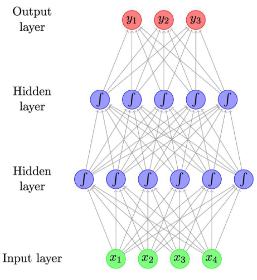

# 神经网络

## 1. 神经元模型

- 神经网络中最基本的成分是神经元（neuron）模型
- 神经元接受来自其他N个神经元传输过来的输入信号，这些输入信号通过带权重的连接进行传递，神经元接收到的总输入值将与神经元的阈值进行比较，然后通过**激活函数**处理以产生神经元的输出

- 理想中的激活函数是阶跃函数，然而阶跃函数具有不连续，不光滑等不太好的性质，因此实际常用$Sigmoid $函数作为激活函数，把较大范围内变化的函数挤压到（0，1）输出值范围内
- 把许多个这样的神经元按一定的层级结构连接起来，就得到了神经网络

## 2. 感知机与多层网络

- 感知机由两层神经元构成：输入层和输出层
- 一般的，给定训练数据，权重$w_i$以及阈值$θ$可通过学习得到

感知机学习规则：训练样例$(x,y)$，当前感知机输出为$\hat{y}$，则感知机权重这样调整：

$$
w_i + \Delta w_i = w_i 

$$

$$
\Delta w_i  = \eta（y-\hat{y}）x_i
$$

其中$\eta\in(0，1)$称为学习率

- 感知机只有输出层神经元进行激活函数处理，即只拥有一层功能神经元，其学习能力非常有限
- 如果进行的任务是线性可分的，则感知机的学习过程一定会收敛，否则将会发生震荡（线性不可分）
- 多层功能神经元（神经网络）可以解决非线性可分问题（more flexible）
- 输入层和输出层之间的一层神经元，被称为隐层或隐含层
- 多层前馈神经网络：每层神经元与下一层神经元全连接，神经元间不存在同层连接和跨层连接

- 输入层：仅接受输入，不进行函数处理
- 隐含层：对信号数据进行加工（包含功能神经元）
- 神经网络的学习过程，就是根据训练数据来调整神经元间的“连接权”以及每个功能神经元的阈值；换言之，学到的东西就在“连接权”和阈值中。

## 3. 误差逆传播（BackPropagation）

- 更好地更高效地计算gradient
- “BP网络”一般指用BP算法训练地多层前馈神经网络

上图的BP网络中共有$dq+ld+q+l$个参数，包含输入层到隐含层的$d*q$个权值，隐含层到输出层的$q*l$个权值，$q$个隐含神经元的阈值，$l  $个输出层神经元的阈值

- BP是一个迭代迭代算法，在迭代的每一轮中对参数进行更新估计，任何参数$v$的更新估计式为$v+\Delta v = v$
- BP算法基于梯度下降策略，学习率$\eta$控制着算法每一轮迭代过程中更新的步长，太大容易震荡，太小收敛速度过慢
- BP算法工作流程：先将输入的信号数据逐层前传直到产生输出层的结果；然后计算输出层的误差，再将误差逆向传播至隐含层神经元，最后根据隐含层神经元的误差来对连接权和阈值进行调整
- BP算法的目标是最小化训练集上的累计误差$E=\frac{1}{m} \sum_{k=1}^mE_k$

标准BP算法VS累积BP算法

- 标准BP算法每次更新只针对单个样例，参数更新非常频繁，且可能出现“抵消”现象，往往需要多次累加的迭代
- 累积BP算法直接针对累积误差最小化，读取整个训练集一遍后才对参数进行更新（one epoch），其参数的更新频率低的多

由于BP神经网络表示能力强大，容易遭受过拟合，通常有2种解决方案：

- 早停（early stopping）：当训练集误差降低但验证集误差升高，停止训练，返回具有最小验证集误差的连接权和阈值
- 正则化（regularization）：在误差函数中增加一个用于描述网络复杂度的部分

## 4. 局部最小

- 局部最小值：参数空间里梯度为0的点，其误差函数值小于邻点的误差函数值，就是局部极小点，“全局最小”一定是“局部最小”
- 若误差函数在当前点的梯度为0，则已到达局部最小，更新量将为0，这意味着参数的更新迭代将在这里停止。然而，误差函数常具有多个局部最小值，此时不能保证是全局最小，称 参数寻优陷入局部最小
- 跳出局部最小的方法
	- 以多组不同参数值初始化多个神经网络，相当于选择多个不同初始值，可能陷入多个局部最优，更可能找到全局最优
	- 模拟退火
	- 随机梯度下降：计算梯度时加入随机因素，即使陷入局部最优，计算出来的梯度不为0，可以继续搜索

## 5. 深度学习

- 计算能力提高缓解训练低效性，训练数据的增加降低过拟合风险→深度学习开始受到关注
- 增加隐层神经元数目→模型复杂度上升
- 增加隐层数目比增加隐层神经元数目更有效？增加隐层数目不仅增加了拥有激活函数的隐层神经元，还增加了激活函数的嵌套层数
- 多层神经网络不能直接用经典算法训练？误差在多隐层内逆传播时，往往会发散而不能收敛到稳定状态
- 无监督逐层训练/预训练（pre-training）：每训练一层隐节点，训练时将上一层隐节点的输出作为输入，而本层隐节点的输出作为下一层隐节点的输入，全部预训练结束后，再对整个网络进行“微调”（fine-tuning）训练
- 预训练+微调=大量参数分组找到局部最优，再综合找全局最优。可以节省训练开销
- 权共享：让一组神经元使用相同的连接权，从而减少训练参数数目，节省训练开销
- 深度学习可理解为“特征学习”或“表示学习”，即让机器自动地去建立特征与预测标签间的关系，即由机器去做特征工程
