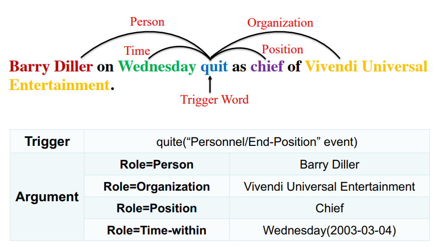
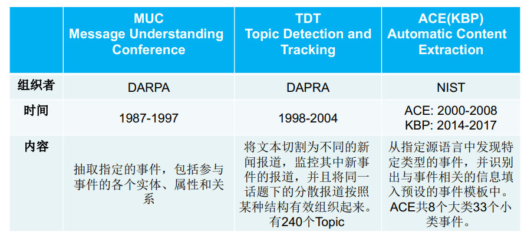
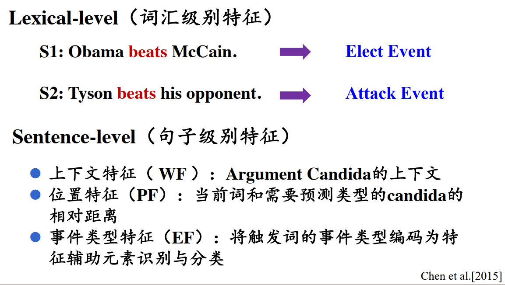
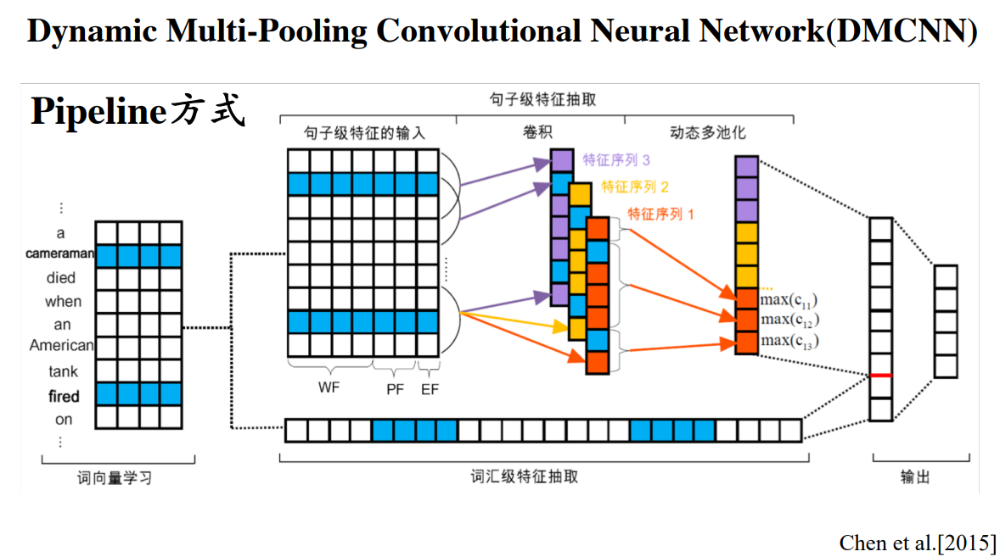
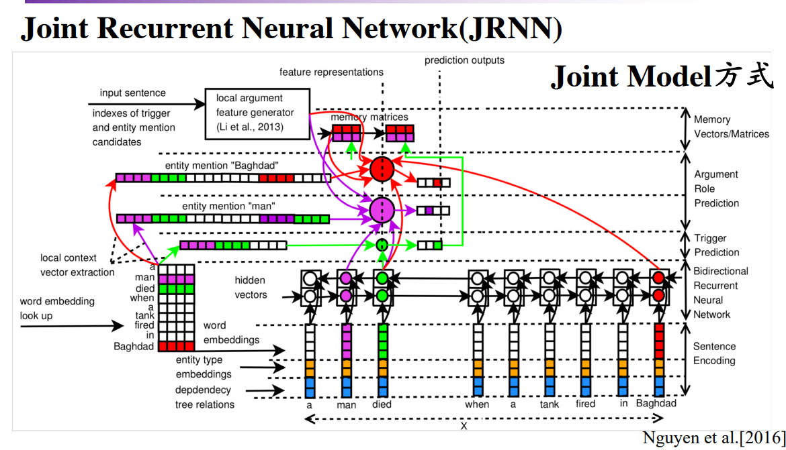
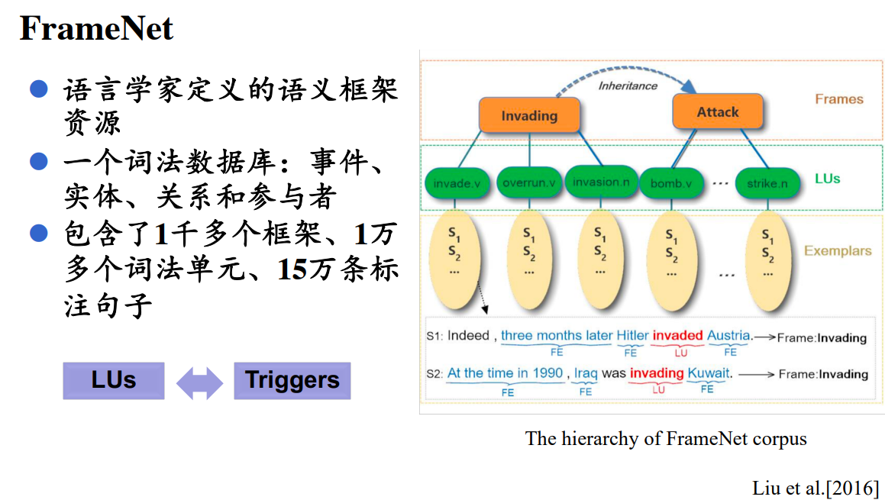
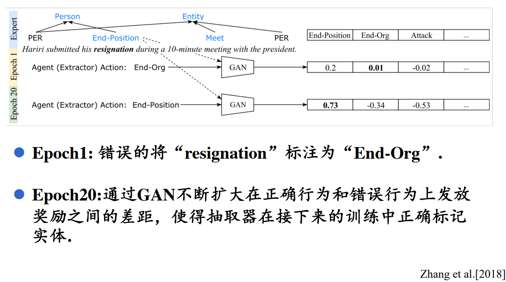

# 事件抽取

## 1. 什么是事件抽取

### 1.1 事件抽取

- 从自然语言文本中抽取用户感兴趣的事件并以结构化的形式呈现出来，如什么人在什么时间，在什么地方干了什么事。

### 1.2 相关术语

- 事件描述（Event Mention）：描述事件的句子
- 事件触发词（Event Trigger）：标记事件类型的词汇
- 事件元素（Event Argument）：事件的参与者
- 事件角色（Event Role）：元素在事件句中扮演的角色

### 1.3 相关子任务

#### 1.3.1事件发现

- 事件触发词检测（Event Trigger Detection）

- 事件触发词分类（Event Trigger Typing）

#### 1.3.2 事件元素抽取
- 事件元素识别（Event Argument Identification）
- 事件元素角色识别（Event Argument Role Identification）
### 1.4 相关评测任务

## 2. 事件抽取方法

### 2.1 基于规则和模板

- 定义语义框架和短语模式来表示特定领域事件的抽取模式

### 2.2 基于机器学习的方法

- 传统的分类任务
- 依赖依存分析，句法分析，词性标注等传统NLP工具
### 2.3 基于深度学习的方法

#### 2.3.1 基于深度学习方法的优势

- 减少了对外部NLP工具的依赖，建模成端到端的系统
- 模型使用词向量作为输入，词向量本身蕴含了丰富的语义信息
- 避免了人工去设计大量特征
#### 2.3.2 Pipeline 方式

#### 2.3.3 Joint Model 方式

Joint Model相比Pipeline优势：

- 避免误差累积传播导致模型性能下降的问题
- 使用一个模型同时抽取出所以的事件信息
- 使用从整体结构中学到的全局特征来提升对局部特征的预测能力
### 2.4 基于知识库的事件抽取

### 2.5 基于强化学习的事件抽取

传统事件抽取模型中，都是在有监督背景下训练模型学习正确的label，而没有对错误的label进行深入分析。这样的模型最终学习到的是如何正确标记句子中的实体，但碰到有歧义的实体时，模型无法区分。因此，引入强化学习，对正确的行为给予奖励，错误的行为获得惩罚，从而让机器对错误label进行学习。

