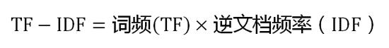
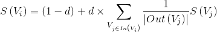
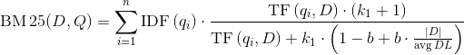

# 信息抽取

## 1. 信息抽取概念

- 信息抽取是一个宽泛的概念，指的是从非结构化文本中提取结构化信息的一类技术。
- 按照信息的颗粒度，可以分为新词、关键词、关键短语和关键句的抽取
## 2. 新词抽取

### 2.1 概述

- 新词是一个相对的概念，每个人的标准都不一样一般认为词典之外的词语(OOV)称作**新词**。
- 新词的提取对中文分词而言具有重要的意义，因为语料库的标注成本很高。新词抽取扩充语料库的迭代过程可以不断优化分词器的效果。
### 2.2 常用方法
- 从大量文本(生语料)中提取出候选新词片段。片段外部左右搭配的丰富程度，可以用**信息熵**来衡量，而片段内部搭配的固定程度可以用子序列的**互信息**来衡量。
- 用词典过滤掉已有的词语，或者采用机器学习的方法对候选新词进行分类，于是得到新词。

### 2.3 **信息熵**

在信息论中，**信息熵**( entropy )指的是某条消息所含的信息量。它反映的是听说某个消息之后，关于该事件的不确定性的减少量。比如抛硬币之前，我们不知道“硬币正反”这个事件的结果。但是一旦有人告诉我们“硬币是正面”这条消息，我们对该次抛硬币事件的不确定性立即降为零，这种不确定性的减小量就是信息熵。公式如下:

\log+P(x)}+ "")

给定字符串 S 作为词语备选，X 定义为该字符串左边可能出现的字符(左邻字)，则称 H(X) 为 S 的左信息熵，类似的，定义右信息熵 H(Y)，例如下列句子:

> 两只**蝴蝶**飞啊飞
这些**蝴蝶**飞走了

那么对于字符串蝴蝶，它的左信息熵为1，而右信息熵为0。因为生语料库中蝴蝶的右邻字一定是飞。假如我们再收集一些句子，比如“蝴蝶效应”“蝴蝶蜕变”之类，就会观察到右信息熵会增大不少。

左右信息熵越大，说明字符串可能的搭配就越丰富，该字符串就是一个词的可能性就越大。

光考虑左右信息熵是不够的，比如“吃了一顿”“看了一遍”“睡了一晚”“去了一趟”中的了一的左右搭配也很丰富。为了更好的效果，我们还必须考虑词语内部片段的凝聚程度，这种凝聚程度由互信息衡量。

### 2.4 **互信息**

**互信息**指的是两个离散型随机变量 X 与 Y 相关程度的度量，定义如下:

互信息的定义可以用韦恩图直观表达:

其中，左圆圈表示H(X)，右圆圈表示H(Y)。它们的并集是联合分布的信息熵H(X,Y)，差集有多件嫡，交集就是互信息。可见互信息越大，两个随机变量的关联就越密切，或者说同时发生的可能性越大。

片段可能有多种组合方式，计算上可以选取所有组合方式中互信息最小的那一种为代表。有了左右信息熵和互信息之后，将两个指标低于一定阈值的片段过滤掉，剩下的片段按频次降序排序，截取最高频次的 N 个片段即完成了词语提取流程。

## 3. 关键词提取

词语颗粒度的信息抽取还存在另一个需求，即提取文章中重要的单词，称为**关键词提起**。
单文档提起可以用词频和TextRank，多文档可以使用TF-IDF来提取关键词。

### 3.1 **词频统计**

关键词通常在文章中反复出现，为了解释关键词，作者通常会反复提及它们。通过统计文章中每种词语的词频并排序，可以初步获取部分关键词。

不过文章中反复出现的词语却不一定是关键词，例如“的”。所以在统计词频之前需要去掉停用词。

词频统计的流程一般是分词、停用词过滤、按词频取前 n 个。其中，求 m 个元素中前 n (n<=m) 大元素的问题通常通过最大堆解决，复杂度为 O(mlogn)。

### 3.2 **TF-IDF**

TF-IDF (Term Frequency-lnverse Document Frequency,词频-倒排文档频次)是信息检索中衡量一个词语重要程度的统计指标，被广泛用于Lucene、Solr、Elasticsearch 等搜索引擎。

相较于词频，TF-IDF 还综合考虑词语的稀有程度。在TF-IDF计算方法中，一个词语的重要程度不光正比于它在文档中的频次，还反比于有多少文档包含它。包含该词语的文档趣多，就说明它越宽泛， 越不能体现文档的特色。 正是因为需要考虑整个语料库或文档集合，所以TF-IDF在关键词提取时属于多文档方法。

计算公式如下:

第一步，计算词频：

考虑到文章有长短之分，为了便于不同文章的比较，进行"词频"标准化。

第二步，计算逆文档频率：

这时，需要一个语料库（corpus），用来模拟语言的使用环境。

如果一个词越常见，那么分母就越大，逆文档频率就越小越接近0。分母之所以要加1，是为了避免分母为0（即所有文档都不包含该词）。log表示对得到的值取对数。

第三步，计算TF-IDF：

可以看到，TF-IDF与一个词在文档中的出现次数成正比，与该词在整个语言中的出现次数成反比。所以，自动提取关键词的算法就很清楚了，就是**计算出文档的每个词的TF-IDF值，然后按降序排列，取排在最前面的几个词。**

其中，t 代表单词，d 代表文档，TF(t,d) 代表 t 在 d 中出现频次，DF(t) 代表有多少篇文档包含 t。DF 的导数称为IDF，这也是 TF-IDF 得名的由来。

### 3.3. **TextRank**

TextRank 是 PageRank 在文本中的应用，PageRank是一种用于排序网页的随机算法，它的工作原理是将互联网看作有向图，互联网上的网页视作节点，节点 Vi 到节点 Vj 的超链接视作有向边，初始化时每个节点的权重 S(Vi) 都是1，以迭代的方式更新每个节点的权重。每次迭代权重的更新表达式如下:

其中 d 是一个介于 (0,1) 之间的常数因子，在PagRank中模拟用户点击链接从而跳出当前网站的概率，In(Vi) 表示链接到 Vi 的节点集合，Out(Vj) 表示从 Vj 出发链接到的节点集合。可见，开不是外链越多，网站的PageRank就越高。网站给别的网站做外链越多，每条外链的权重就越低。如果一个网站的外链都是这种权重很低的外链，那么PageRank也会下降，造成不良反应。正所谓物以类聚，垃圾网站推荐的链接往往也是垃圾网站。因此PageRank能够比较公正的反映网站的排名。

将 PageRank 应用到关键词提取，无非是将单词视作节点而已，另外，每个单词的外链来自自身前后固定大小的窗口内的所有单词。

## 4. 短语提取

- 在信息抽取领域，另一项重要的任务就是提取中文短语，也即固定多字词表达串的识别。短语提取经常用于搜索引擎的自动推荐，文档的简介生成等。
- 利用互信息和左右信息熵，我们可以轻松地将新词提取算法拓展到短语提取。只需将新词提取时的字符替换为单词， 字符串替换为单词列表即可。为了得到单词，我们依然需要进行中文分词。 大多数时候， 停用词对短语含义表达帮助不大，所以通常在分词后过滤掉。
## 5. 关键句提取

一篇文章中几乎不可能出现相同的两个句子，所以朴素的 PageRank 在句子颗粒度上行不通。为了将 PageRank 利用到句子颗粒度上去，引人 BM25 算法衡量句子的相似度，改进链接的权重计算。这样窗口的中心句与相邻的句子间的链接变得有强有弱，相似的句子将得到更高的投票。而文章的中心句往往与其他解释说明的句子存在较高的相似性，这恰好为算法提供了落脚点。

### 5.1 **BM25**

在信息检索领域中，BM25 是TF-IDF的一种改进变种。TF-IDF衡量的是单个词语在文档中的重要程度，而在搜索引擎中，查询串(query)往往是由多个词语构成的。如何衡量多个词语与文档的关联程度，就是BM25所解决的问题。

形式化的定义 Q 为查询语句，由关键字 q1 到 qn 组成，D 为一个被检索的文档，BM25度量如下:

### 5.2 **TextRank**

有了BM25算法之后，将一个句子视作查询语句，相邻的句子视作待查询的文档，就能得到它们之间的相似度。以此相似度作为 PageRank 中的链接的权重，于是得到一种改进算法，称为TextRank。它的形式化计算方法如下:

其中，WS(Vi) 就是文档中第 i 个句子的得分，重复迭代该表达式若干次之后得到最终的分值，排序后输出前 N 个即得到关键句。

