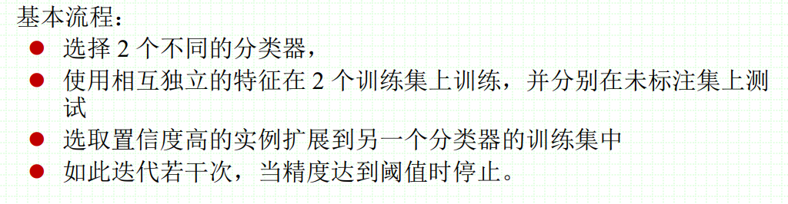
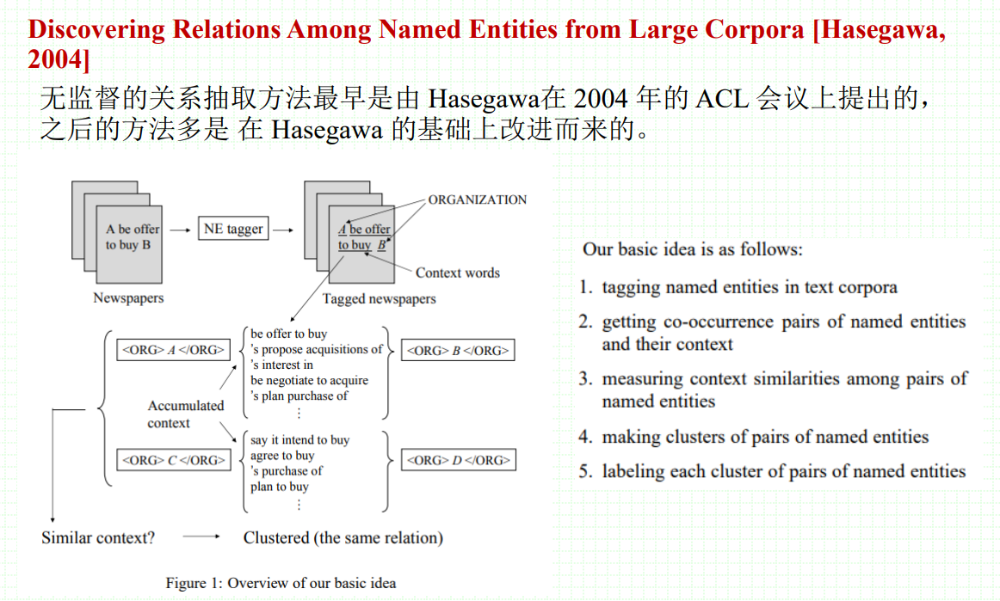
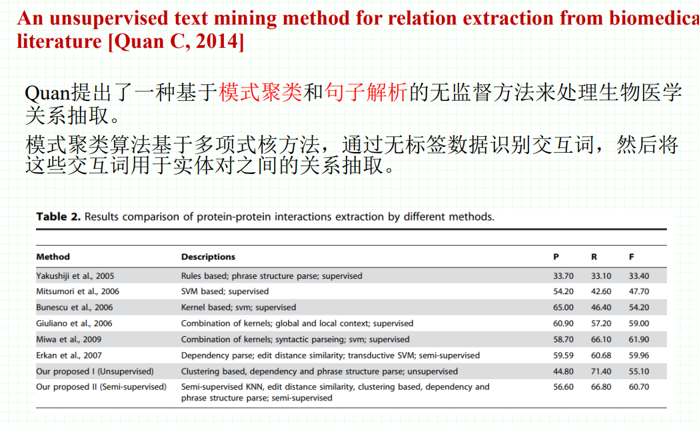
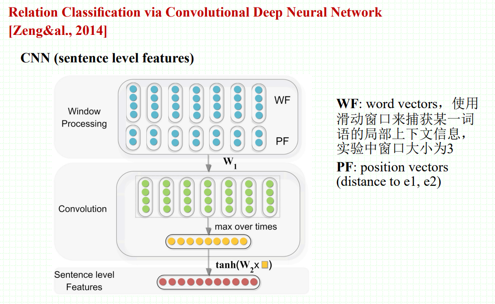

# 关系抽取

## 1. 关系抽取简介

### 1.1 什么是语义关系

- 是指隐藏在句法结构后面由词语的语义范畴建立起来的关系
- 在句子中地位很重要
- 连接文本中的实体
- 与实体一起表达出文本中的含义
- 并不是很难识别
### 1.2 语义关系的两种视角
- 概念间的关系
	- 主要是关于世界的知识
	- 可以从文本中发现
- 名词间的关系
	- 主要是关注文本所表达的事件或者形势
	- 可以通过知识库信息进行发现

### 1.2 句法关系（Syntactic relations）

#### 1.2.1 位置关系

- 位置关系是组合关系一个方面的表现（索绪尔）

- 也被称为横向关系或者链状关系

#### 1.2.2 替代关系

- 指的是某个结构的位置上彼此可以相互替换的成分之间的关系

- 被称为联想关系（索绪尔）或者聚合关系（叶列姆斯列夫）

- 也被称为纵向关系或者选择关系

#### 1.2.3 同现关系

- 同现关系指的是小句子中不同集合关系的词语允许或要求和另一集合或类别中的词语一起组成句子或句子的某一特定部分。

- 同现关系部分属于组合关系，部分属于聚合关系

#### 1.2.4 组合关系vs聚合关系

- 频繁出现的组合关系可能成为我们记忆的一部分，从而成为范式（Harris，1987）
- 聚合关系的实例来自于累积的组合数据（Gardin，1965）
- 这反映了当前对开放文本关系抽取的思考
### 1.3 语义关系的双重性
- 逻辑方面：谓语
	- 用于AI以支持知识的表示和推理
- 图方面：弧形连接概念
	- 在NLP中可以用于表示事实性知识
	- 主要是二元关系

### 1.4 自动化知识获取

- 学习本体关系
	- is-a（Hearst，1992）
	- part-of（Berland & Charniak，1999）
- bootstrapping（Patwardhan & Riloff，2007；Ravichandran & Hovy，2002）
- 开放式关系抽取
	- 没有预先指定的关系列表或关系类型
	- 学习关系表达的模式
		- POS（Fader&al.，2011）
		- paths in a syntactic tree（Ciaramita&al.，2005）
		- sequences of high-frequency words（Davidov & Rappoport，2008）
	- 抽取结果很难映射到知识库中

## 2. 关系抽取中的特征

### 2.1 学习语义关系的方法

- 监督学习
	- 优点：表现很好
	- 缺点：需要大量的标记数据和特征表示
- 无监督学习
	- 优点：可拓展，适用于开放式信息抽取
	- 缺点：表现比较差

### 2.2 特征

- 目的：将数据映射为向量
- 实体特征：捕捉关系实体中参数语义的一些表示
- 关系特征：直接对关系进行表征，表征参数间的相互作用，如对实体中实体的上下文进行建模
### 2.3 实体特征
- 基本实体特征
	- 字符串值
	- 单独的词、词形话或者词干化
- 实体背景特征
	- 句法信息，如：语法角色
	- 语义信息，如：语义类别，语义类别的聚类
	- 表征空间中的单词共现
		- 协调（and/or）
		- 分布表示
			- 优点：聚合一个词与在大文本集合中与所有其他词的交互来捕捉它的含义
			- 缺点：会把不同的含义混杂在一起（一词多义）
		- 关系语义表示
			- 使用来自语义网络或者形式本体的相关概念
			- 优点：以词的含义为基础，而不仅仅是词本身
			- 缺点：需要确保词的含义无歧义
		- 词嵌入（Nguyen & Grishman，2014）
	### 2.4 关系特征
- 直接对关系进行表征，例如对实体的**上下文进行建模**
- 基本实体特征：
	- 在两个参数之间的单词
	- 处于参数的特定窗口或者一侧的单词
	- 链接参数的依赖路径
	- 一个完整的依赖图
	- 最小支配子树
- 关系背景特征：
	- 通过释义进行关系表征
	- 占位符模式
	- 通过聚类寻找相似上下文

## 3. 关系抽取数据集

- MUC和ACE
- SemEval-2007 Task-4
- SemEval-2010 Task-8
## 4. 关系抽取方法
### 4.1 基于模板的实体关系抽取
- 使用规则挖掘关系，基于触发词等
- 基于依存句法
	
- 优点：
	- 人工规则有高准确率
	- 可以为特定领域定制
	- 在小规模数据集上容易实现，构建简单
- 缺点：
	- 低召回率
	- 模板需要专家构建，时间精力成本高
	- 难以维护
	- 可移植性差

### 4.2 有监督实体关系抽取

#### 4.2.1 基于特征向量的方法

- 从上下文信息、词性、语法等中抽取一系列特征
	

#### 4.2.2 核分类

- 关系特征可能拥有复杂的结构
	

#### 4.2.3 序列标注方法

- 关系中参数的跨度是可变的
	
	

### 4.3 弱监督关系抽取

#### 4.3.1 Bootstrapping

#### 4.3.2  Label propagation（Jinxiu Chen，2006）

#### 4.3.3 Co-learning（A. Cvitas，2011）

### 4.4 无监督关系抽取

首先采用某种聚类方法将语义相似度高的实体对聚为一类，再选择具有代表性的词语来标记这类关系

### 4.5 基于深度学习的关系抽取

- MV-RNN
	
- CNN
	
- Att-BiLSTM
	
