# 命名实体识别

## 1. 命名实体识别简介

- NER研究的命名实体一般分为3大类（实体、时间、数字）和7小类（人名、地名、组织机构名、时间、日期、货币和百分比）
- 命名实体识别效果的评判主要看实体的边界是否划分正确以及实体的类型是否标注正确
- 汉语言中，实体边界的识别相较于实体类型的标注任务更困难

## 2. 中文命名实体识别难点

-  各类命名实体的数量众多
- 命名实体的构成规律复杂
- 嵌套情况复杂
- 长度不确定

## 3. 命名实体识别的三种方法

### 3.1 基于规则和词典

流程：

1. 预处理
	- 划分句子
	- 分词+词性标注
	- 构建词典
2. 识别实体边界
	- 初始化边界：词典匹配、拼写规则、特殊字符、特征词和标点符号等
3. 命名实体分类
	- 使用分类规则
	- 基于词典的分类

词典的用处：

- 辅助分词
- 实体抽取时根据字典匹配
- 基于词典对实体分类

缺点：过于依赖具体语言、领域和文本风格，编制过程耗时且难以覆盖所有语言现象

### 3.2 基于统计机器学习

- 将命名实体识别任务作为序列标注问题来解决
- 可以用来建设和评估命名实体识别系统的大规模通用语料库较少，是该方法的一大制约
- 常见序列标注方法：
	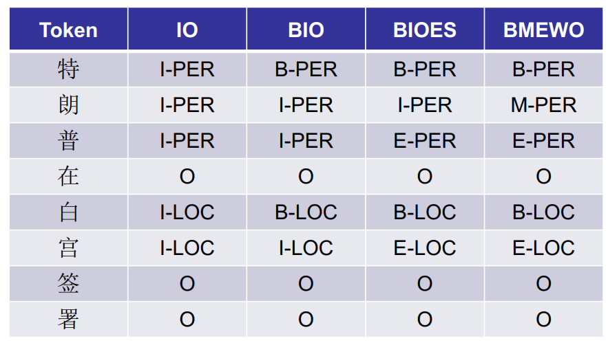

基于机器学习的主要方法包括：

- 隐马尔可夫模型（Hidden Markov Model, HMM）
	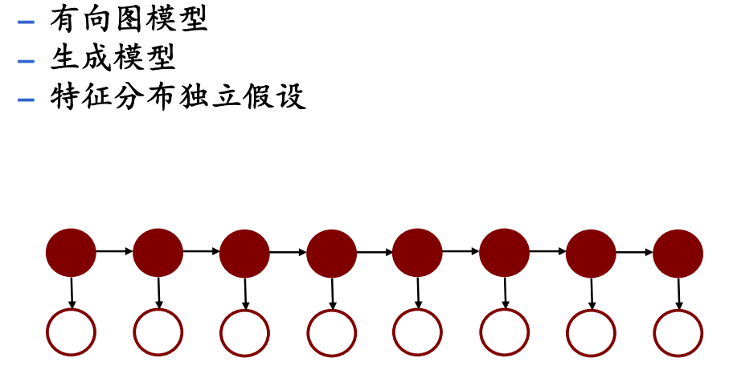
- 最大熵马尔可夫模型（Maximum Entropy Markov Model, MEMM）
- 条件随机场（Conditional Random Fields, CRF）
	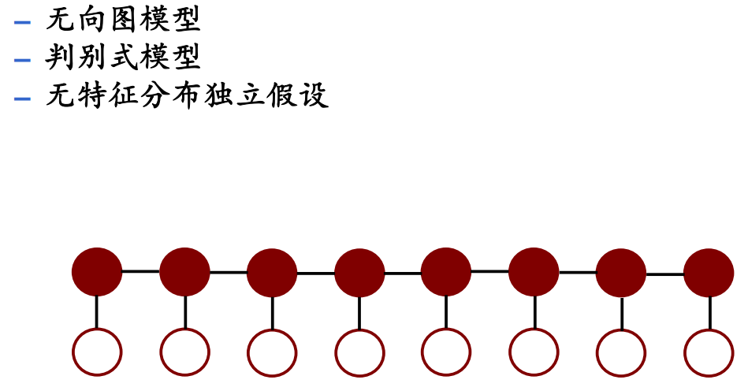
- 支持向量机（Support Vector Machine, SVM）
### 3.3 混合方法
- 单独基于统计的方法使状态搜索空间非常巨大，借助规则知识提前进行过滤剪枝处理。
- 序列标注方式是目前命名实体识别中的主流方法。
### 3.4 深度学习
- CNN+CRF
	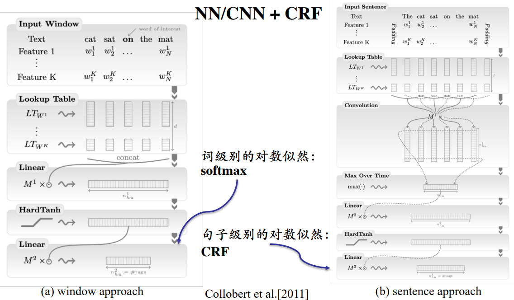
	
- Bi-LSTM+CRF
	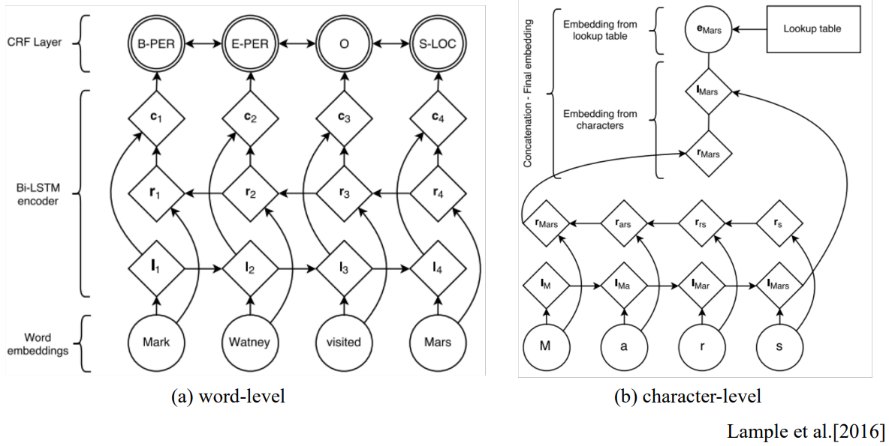
	
	
- Bi-LSTM+CNN+CRF
	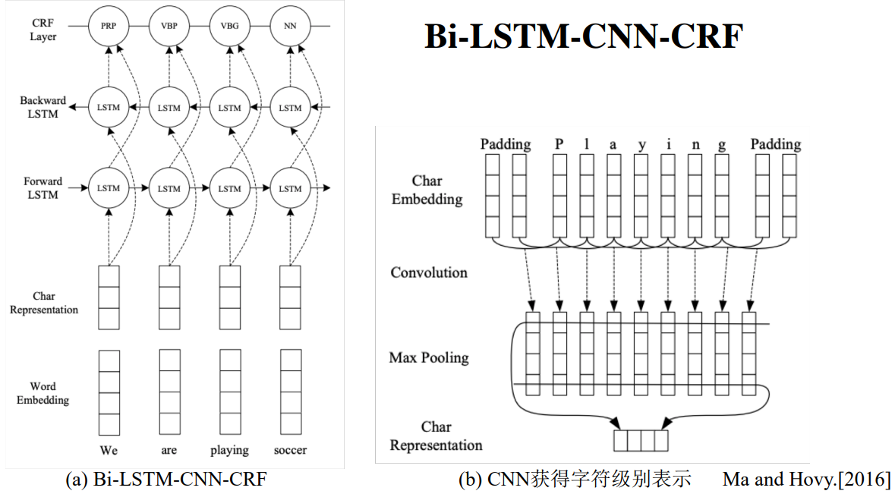
	

### 3.5 基于半监督

- TagLM
	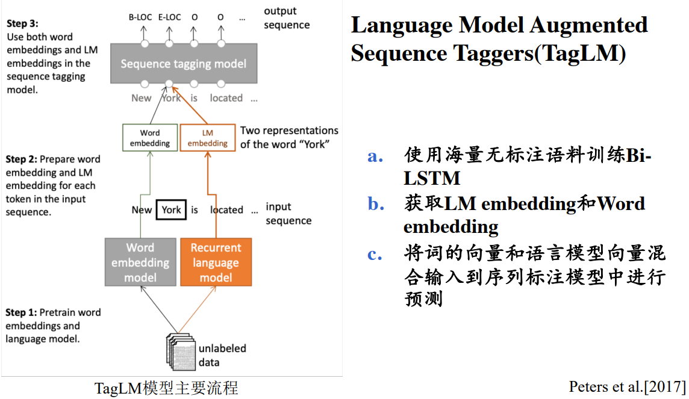
	
	

### 3.6 迁移学习

迁移学习的核心在于找到新问题和原问题之间的相似性。迁移学习是机器学习的一个类别，但是在如下几个方面又有别于传统的机器学习。

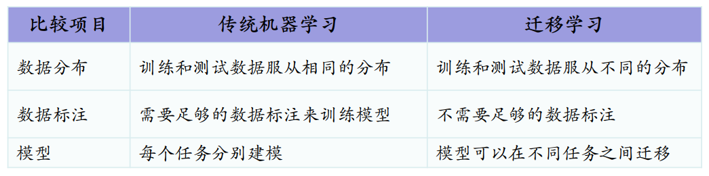

迁移学习的三种模式：

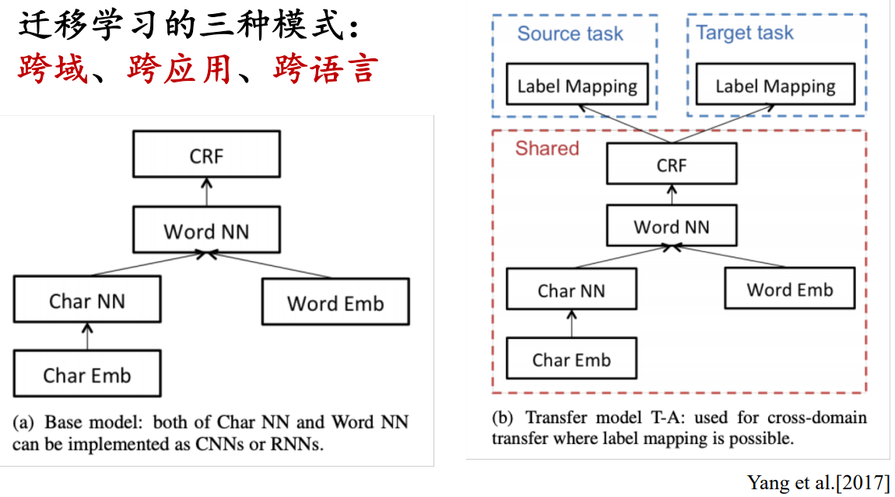

迁移学习模型表现：

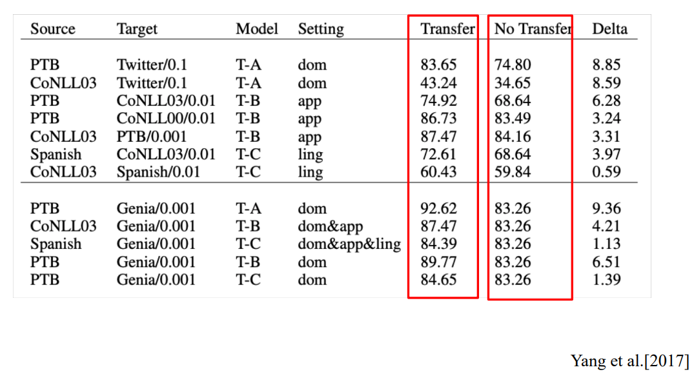

### 3.7 基于预训练

BERT模型重新设计了语言模型预训练阶段的目标任务，提出了遮挡语言模型（Masked LM）和下一个句子预测（NSP）

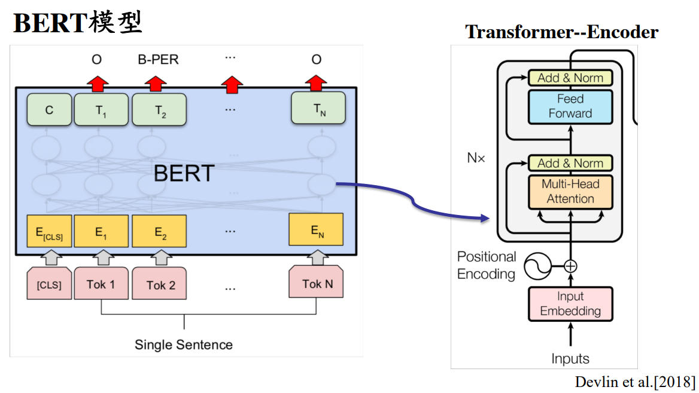

遮挡语言模型（Masked LM）

- Masked LM是在输入的词序列中，随机选取15%的词进行[MASK]，然后在这15%的词中，有80%的词被真正打上[MASK]标签，有10%的词被随机替换成任意词汇，10%的词不做任何处理。模型的任务是去正确预测带有[MASK]标签的词。相比于传统的语言模型，Masked LM可以从前后两个方向预测这些带有[MASK]标签的词。

下一个句子预测（NSP）

- NSP实质上是一个二分类任务，以50%的概率输入一个句子和下一个句子的拼接，标签属于正例；另外50%的概率输入一个句子和非下一个随机句子的拼接，标签属于负例

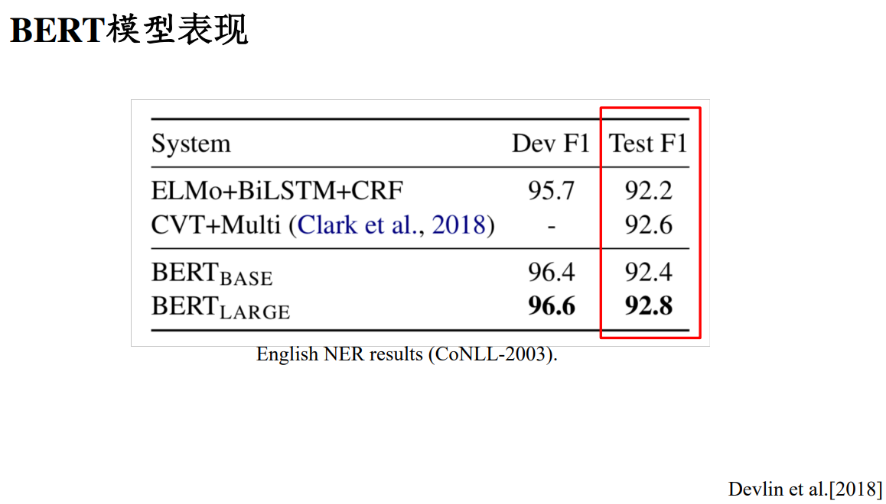

## 4. 减少未登录词影响的措施

- 扩展语料，改进模型。如加入词性特征，调整分词算法等
- 整理地理位置词库。识别时，先通过词库匹配，再采用模型进行发展。（先剪枝）

