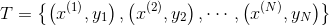

# 文本分类

## 1. 文本分类的概念

- **文本分类**( text classification),又称**文档分类**( document classification),指的是将一个文档归类到一个或多个类别中的自然语言处理任务。文本分类的应用场景非常广泛，涵盖垃圾邮件过滤、垃圾评论过滤、自动标签、情感分析等任何需要自动归档文本的场合。
- 文本的类别有时又称作**标签**，所有类别组成了标注集，文本分类输出结果一定属于标注集。
- 文本分类是一个典型的监督学习任务，其流程离不开人工指导: 人工标注文档的类别，利用语料训练模型，利用模型预测文档的类别。
## 2. 文本分类的特征提取
在机器学习中，我们需要对具体对象提取出有助于分类的特征，才能交给某个分类器进行分类。这些特征数值化后为一个定长的向量(数据点)，用来作为分类器的输入。在训练时，分类器根据数据集中的数据点学习出决策边界。在预测时，分类器根据输人的效据点落在决策边界的位置来决定类别。
1. **卡方特征选择**
	在文本分类时会有这样一个问题，比如汉语中的虚词“的”，这些词在所有类别的文档中均匀出现，为了消除这些单词的影响，一方面可以用停用词表，另一方面可以用**卡方非参数检验**来过滤掉与类别相关程度不高的词语。
	在统计学上，卡方检验常用于检验两个事件的独立性，如果两个随机事件 A 和 B 相互独立，则两者同时发生的概率P(AB)= P(A)P(B)。如果将词语的出现与类别的出现作为两个随机事件则类别独立性越高的词语越不适合作为特征。如果将某个事件的期望记作 E，实际出现(观测)的频次记作 N，则卡方检验衡量期望与观测的相似程度。卡方检验值越高，则期望和观测的计数越相化也更大程度地否定了独立性。
	一旦确定了哪些特征有用，接下来就可以将文档转化为向量了。
2. **词袋向量**
	我们提取的是 TF 特征，统计出每个特征及其频次。以特征的 id 作为下标，频次作为数值，假设一共有 n 个特征，一篇文档就转化为 n 维的词袋向量。沿用机器学习文献的习惯，将词袋向量记作 x，向量的第 i 维记作 X1。将类别记作 y，其中 K 为类别总数。则语料库(训练数据集) T 可以表示为词袋向量 x 和类别 y 所构成的二元组的集合:
	
	在不进行特征选择的前提下，如果以词语作为特征，则 n 大约在 10 万量级；如果以字符二元语法作为特征，则 n 大约在 50 万量级。数十万维的向量运算开销不容小觑，一般利用卡方特征选择，可以将特征数量减小到10% ~ 20%左右。
	当文档被转化为向量后，就可以利用机器学习进行训练了。
