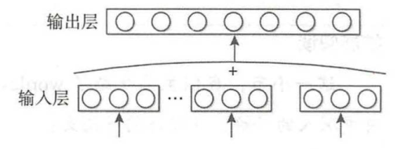

# 文本向量化

即将文本表示为一系列能表达文本语义的向量

## 1. 词袋模型

*   **词袋（Bag of Word）模型：**最早的以词语为基本处理单元的文本向量化方法；从文档语料库构建一个词汇表，并计算单词在每个文档中出现的次数。换句话说，词汇表中的每个单词都成为一个特征，文档由具有相同词汇量长度的矢量（一个“词袋”）表示。例如，我们有3个句子，并用这种方法表示它们：

特征矩阵的形状：文档数x词汇表长度

*   **词袋模型存在的问题：**

    *   维度灾难

        *   为了减少维度问题，词袋法模型通常需要先进行重要的预处理（词清除、删除停用词、词干提取/词形还原）

    *   无法保留词序信息

    *   存在语义鸿沟问题

*   **词袋变体：**

    *   **词频-逆向文件频率（Tf-Idf）：**词频不一定是文本的最佳表示方法。实际上我们会发现，有些常用词在语料库中出现频率很高，但是它们对目标变量的预测能力却很小。为了解决此问题，有一种词袋法的高级变体，它使用词频-逆向文件频率（Tf-Idf）代替简单的计数。基本上，一个单词的值和它的计数成正比地增加，但是和它在语料库中出现的频率成反比。

## 2. 词嵌入（Word2vec）

词嵌入（Word Embedding）是将中词表中的词映射为实数向量的特征学习技术的统称。这些向量是根据每个词出现在另一个词之前或之后的概率分布计算出来的。换一种说法，上下文相同的单词通常会一起出现在语料库中，所以它们在向量空间中也会很接近。常见的词嵌入方法有Google的Word2Vec（2013），斯坦福大学的GloVe（2014）和Facebook的FastText（2016）。

*   提出的基础（分布假说）：因为词袋只是将词语符号化，不包含语义信息。在分布假说的思想里，上下文相似的词，其语义也相似

*   CBOW模型

    

    根据上下文来预测当前词语的概率，使用文本中间词作为目标词，同时去除隐藏层从而提升运算速率，其输入层激吻语义上下文的表示；

*   Skim-gram模型

    

    根据当前词语来预测上下文概率，从目标词$w$的上下文中选择一个词，然后将其词向量组成上下文的表示，模型目标函数为：

